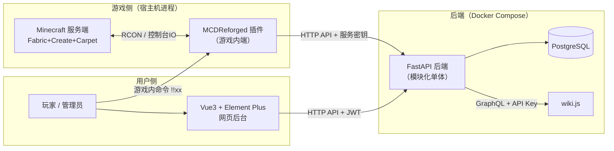
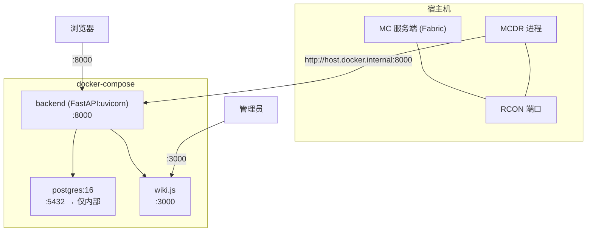
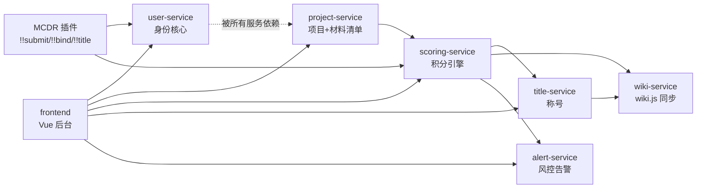
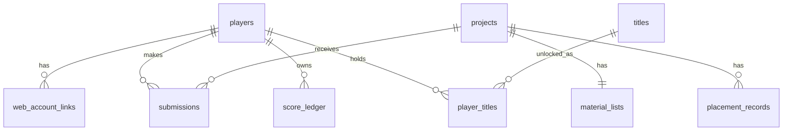
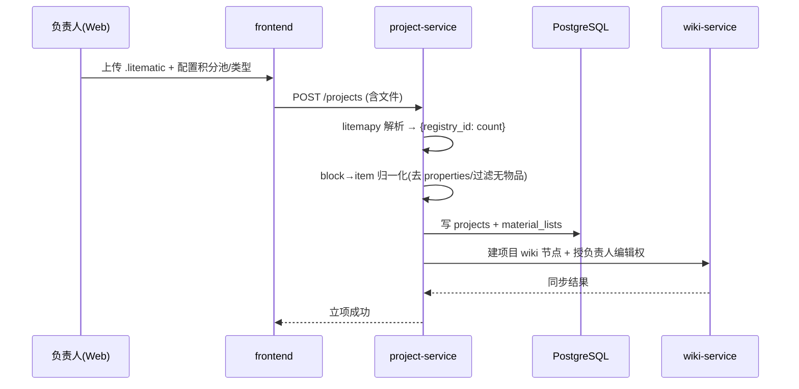
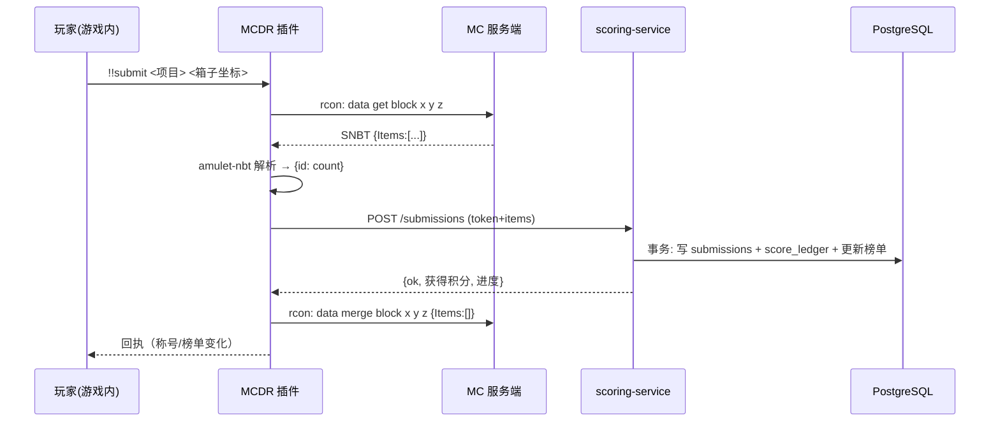

# HTCMC PCHSystem 架构文档（统一总览）

> **版本**：v0.1（2026-07-01 初版）
> **玩法设计**：见 [`guied.md`](./guied.md)
> **本文档定位**：工程架构的统一总览与导航。各服务详见 [`architecture/services/`](./architecture/services/)，全局数据模型详见 [`architecture/data-model.md`](./architecture/data-model.md)，前端详见 [`architecture/frontend.md`](./architecture/frontend.md)。

---

## 1. 项目概述与定位

HTCMC PCHSystem 是面向「白名单生电社区服」的**项目制工程贡献与荣誉体系**系统。

| 维度 | 内容 |
|---|---|
| 核心定位 | 白名单生电社区服 · 项目制协作玩法 · **纯荣誉激励**（积分不可自由转移） |
| 设计原则 | 风控前置入服、流程全自动化、运营轻量化 |
| 服务端 | Minecraft · **Fabric + Create + Carpet** |
| 验证模式 | **离线模式**（`online-mode=false`） |

**三端职责**：

- **游戏内端（MCDR 插件）**：命令菜单、箱子批量提交、信息查询、称号实时生效。
- **网页后台端（Vue + FastAPI）**：项目配置、积分结算、权限管控、进度监控。
- **Wiki 端（wiki.js）**：项目归档沉淀、荣誉榜单展示、项目节点编辑。

---

## 2. 总体架构

### 2.1 三端架构（API 网关 · 完全分离）

**核心约束**：

- **数据唯一拥有者**：所有业务数据集中在 **PostgreSQL**，由 **FastAPI 后端独占**读写。MCDR 插件**不直连数据库**，仅通过 HTTP API 与后端交互。
- **MCDR 是纯游戏内客户端**：只负责命令交互、箱子/背包扫描、称号下发、HTTP 上报。
- **wiki.js 只接收**：由后端通过 GraphQL **单向同步**归档与用户组，不回写业务库。
- **离线身份锚**：因离线模式 UUID 由玩家名确定性推导，**以「Web 绑定账号」为身份主锚**，MC UUID 为子身份（见 [`services/user-service.md`](./architecture/services/user-service.md)）。

### 2.2 后端架构粒度：模块化单体（Modular Monolith）

后端**部署为单一 FastAPI 服务**，内部按领域强边界划分模块；**不拆分独立子服务**。理由：

- 社区服规模（玩家几十~几百、QPS 低、维护者少），微服务属过度设计。
- 积分结算涉及跨表事务（提交→扣需求→记流水→更新榜单），**单库事务**保证一致性最简单可靠。
- 模块边界清晰，未来真要拆分（如独立的用户中心）是平滑路径。

> 文档虽按「服务」拆分子文档，但这是**逻辑边界**，部署仍是单体。

---

## 3. 技术栈与 ADR 决策记录

| 维度 | 决策 | 关键依据 / 证据 |
|---|---|---|
| 整体架构 | **API 网关 · 完全分离** | MCDR 仅作游戏内客户端，后端独占数据 |
| 后端 | **Python · FastAPI** | 异步 + 自动 OpenAPI；与 MCDR 同语言 |
| 后端粒度 | **模块化单体** | 跨表事务一致性 + 低运维 |
| 前端 | **Vue 3 + Element Plus** | 中文后台组件生态齐全 |
| 数据库 | **PostgreSQL** | 窗口函数/CTE 适配占比与榜单聚合 |
| MC 服务端 | Fabric + Create + Carpet | CSV 材质清单印证 Create 模组 |
| MC 层 | **MCDReforged 插件** | 仅游戏内交互 + HTTP 客户端 |
| 材料清单解析 | **直接解析 `.litematic`**（[`litemapy`](https://github.com/Spindust/litemapy)） | 直拿 registry id，根治 CSV 显示名不匹配 |
| 部署 | **Docker Compose** | 后端+PG+wiki.js 容器化 |
| 验证模式 | 离线模式 | OfflinePlayer UUID + [`offline-whitelist`](https://github.com/skuzow/offline-whitelist) |
| 称号前缀 | scoreboard team prefix + [Title Prefix Handler](https://mcdreforged.com/zh-CN/plugin/title_prefix_handler) | 复用现成 handler 修正前缀对解析的干扰 |
| 告警 | Notifier 抽象接口，首期「游戏内 + 后台日志」 | 预留 QQ/Discord webhook |

### 3.1 关键技术可行性结论（均经调研验证，非想当然）

| 关键点 | 结论 | 证据 |
|---|---|---|
| MCDR 命令注册 | ✅ 低 | [`server.register_command(Literal(...))`](https://docs.mcdreforged.com/zh-cn/latest/) |
| MCDR 取命令输出 | ✅ 中 | `server.rcon_query('data get block x y z')` 返回 SNBT |
| 箱子/背包扫描 | ✅ 中 | RCON + **自研/引入 [`amulet-nbt`](https://github.com/Amulet-Team/amulet-nbt) 解析 SNBT** |
| 清空箱子 | ✅ 低 | **`data merge block x y z {Items:[]}`**（非 `/clear`） |
| MC UUID（离线） | ✅ 低 | `MD5("OfflinePlayer:"+name)` → v3 UUID，确定性可推导 |
| MCDR 外联 HTTP | ✅ 低 | `requests`/`aiohttp` + `schedule_task` + 异步事件监听 |
| `.litematic` 解析 | ✅ 低-中 | [`litemapy`](https://github.com/Spindust/litemapy) `Schematic.load` → `block.blockid` |
| wiki.js 页面 CRUD | ✅ 低 | GraphQL `pages.create/update/delete` |
| wiki.js 用户组 | ✅ 低 | `groups.assignUser/unassignUser` |
| wiki.js 编辑权限授权 | ✅ 中 | `groups.update(pageRules)`，`match:START` + `roles:["write:pages"]` |
| wiki.js 建用户 | ✅ 低 | `users.create(providerKey:"local")`，可选 OIDC/SSO |

---

## 4. 部署架构（Docker Compose）

**服务清单**：

| 服务 | 镜像/形态 | 端口 | 说明 |
|---|---|---|---|
| `backend` | FastAPI + uvicorn | 8000 | 模块化单体后端 |
| `postgres` | postgres:16 | 5432（内部） | 唯一业务数据库 |
| `wiki.js` | requarks/wiki | 3000 | 归档与荣誉展示 |
| MCDR + MC | 宿主进程 | — | 不容器化，与游戏端同生命周期 |

**密钥与环境**：`POSTGRES_*`、`WIKI_API_KEY`、`MCDR_SERVICE_TOKEN`（MCDR↔后端双向鉴权）、`JWT_SECRET` 等通过 `.env` / docker secrets 注入，**不进代码库**。

> 待确认：是否最终容器化 MC 服务端（首版建议宿主跑，避免 Fabric mod 挂载复杂度）。

---

## 5. 服务 / 模块地图

| 服务 | 职责 | 文档 |
|---|---|---|
| **MCDR 插件**（游戏内端） | 命令、箱子/背包扫描、UUID 推导、称号下发、HTTP 上报 | [`services/mcdr-plugin.md`](./architecture/services/mcdr-plugin.md) |
| **user-service** | MC 绑定 / Token / wiki 账号映射 / 权限（身份主锚） | [`services/user-service.md`](./architecture/services/user-service.md) |
| **project-service** | 项目生命周期 + `.litematic` 解析 + 材料清单 | [`services/project-service.md`](./architecture/services/project-service.md) |
| **scoring-service** | 提交入库 + 放置贡献 + 黄皮子积分引擎 | [`services/scoring-service.md`](./architecture/services/scoring-service.md) |
| **title-service** | 指数称号体系 + scoreboard 前缀下发 | [`services/title-service.md`](./architecture/services/title-service.md) |
| **wiki-service** | GraphQL 同步归档 + 用户组 + Page Rules 授权 | [`services/wiki-service.md`](./architecture/services/wiki-service.md) |
| **alert-service** | 异常检测 + Notifier 抽象（游戏内/后台/QQ webhook） | [`services/alert-service.md`](./architecture/services/alert-service.md) |
| **frontend** | Vue3 后台管理界面 | [`frontend.md`](./architecture/frontend.md) |

---

## 6. 全局数据模型概览

完整 ER 图与 DDL 见 [`architecture/data-model.md`](./architecture/data-model.md)。核心实体：

关键表：`players`、`web_accounts`、`bind_tokens`、`projects`、`material_lists`、`submissions`、`placement_records`、`score_ledger`、`titles`、`player_titles`、`wiki_sync_log`、`alerts`。

**设计要点**：
- **主键**：玩家用 `UUID`（离线 OfflinePlayer 推导），Web 账号独立主键 + 关联表。
- **积分流水 `score_ledger`**：append-only，任何积分变动都记一条，`balance_after` 便于审计与重建榜单。
- **防重复提交**：`submissions` 上 `(project_id, player_id, item_id, batch_token)` 唯一约束。
- **block→item 归一化**：材料清单与提交均以 **registry id** 存储（`create:warehouse`），存储前剥离 BlockState properties。

---

## 7. 跨服务核心业务流程

### 7.1 立项（导入投影 → 材料清单 → 积分池）

### 7.2 材料提交结算（核心链路）

> 关键：**扫描 → 上报 → 后端事务入库 → 成功后才清箱**，避免清箱后上报失败导致材料丢失。

### 7.3 称号解锁与公告

积分写入 → `scoring-service` 触发 `title-service` 检查 `S_升级 = S_基 × r^(等级-1)` → 达标则解锁、记 `player_titles` → 高阶触发全服公告 → MCDR 经 scoreboard 下发前缀。

### 7.4 项目完结 → 归档同步

`project-service` 标记完结 → `scoring-service` 终算（占比/加权/负责人 k 增发）→ `wiki-service` 写归档页 + 名人堂 + 回收负责人 wiki 编辑权。

---

## 8. 全局风险矩阵

| 风险 | 影响 | 概率 | 缓解 |
|---|---|---|---|
| SNBT 解析自研工作量大 | 扫描不准/开发延期 | 中 | 引入 [`amulet-nbt`](https://github.com/Amulet-Team/amulet-nbt)，不自研 |
| 离线改名 = 换身份 | 历史积分丢失 | 中 | Web 账号作身份锚 + 「改名过户」运维流程 |
| 物品 block↔item 归一化边界 | 清单与提交对不上 | 中 | 维护无物品黑名单 + 去 properties，集中在 `project-service` |
| wiki.js Page Rules 优先级绕 | 授权不准 | 中 | 全局权限先开 + Deny/Allow 测试用例验证 |
| RCON 性能（批量扫描） | 卡顿/超时 | 低 | 多箱扫描串行 + 限频 + 超时熔断 |
| 「扫描成功但上报失败」后清箱 | 材料丢失 | 中 | **先上报成功再清箱**；失败不清箱 + 玩家可重试 |
| wiki.js API Key 权限过大 | 安全风险 | 低 | 专用 Key + 定期轮换 + 仅内网可达 |

---

## 9. 待确认 / 后续阶段

> 下列项不影响架构骨架，开发前需逐项拍板（各子文档中以 `> 待确认：…` 标注）。

- **积分参数具体值**：负责人系数 `k∈[0.05,0.5]` 的分档、A 类 `α/β`、指数称号的 `S_基 / r`、赛季重置周期。文档将给建议范围。
- **外置登录站**：若未来从纯离线切换到 authlib-injector 外置登录，UUID 由站下发，`user-service` 需对接。
- **Fabric 前缀 mod**：首期用 scoreboard team prefix（+ Title Prefix Handler）；若需彩色多行 Tab，再引入 Fabric 前缀 mod。
- **告警扩展**：QQ/Discord webhook 何时接入（Notifier 已留扩展点）。
- **MC 服务端容器化**：首版宿主跑，后续按需容器化。
- **白名单与社区自治联动**：「长期零贡献触发白名单复核」「项目互评信用分」的具体阈值与流程。

---

*本文档与各子文档随项目演进持续更新。所有技术结论附调研证据 URL，可点击复核。*
