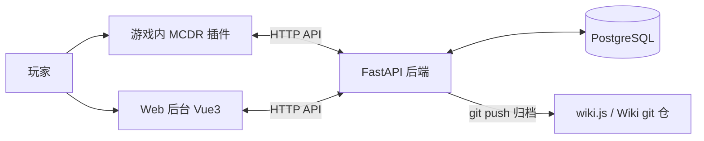

# HTCMC PCHSystem 架构文档（统一总览）

> 本文件是**顶层索引**——只讲全局架构与跨服务关系，**不含实现细节**（时序图 / SQL / 端点表 / 表结构 / ADR 论证一律在各子文档）。
> 玩法设计见 [`guied.md`](./guied.md)；红线与命名见根 [`CLAUDE.md`](../CLAUDE.md)；开发指令见 [速查表](./Cheatsheets/dev-cheatsheet.md)。

---

## 1. 项目定位

白名单生电社区服 · 项目制工程协作玩法 · 纯荣誉激励（积分无实际价值）。三端联动：**游戏内端**（MCDR 命令交互）+ **网页后台端**（项目管理 / 积分 / 权限）+ **Wiki 端**（归档沉淀 / 荣誉榜单）。详细玩法见 [`guied.md`](./guied.md)。

---

## 2. 三端架构

```mermaid
flowchart LR
    P[玩家] --> MC[游戏内 MCDR 插件]
    P --> W[Web 后台 Vue3]
    MC <-->|HTTP API| API[FastAPI 后端]
    W <-->|HTTP API| API
    API <--> DB[(PostgreSQL)]
    API -->|git push 归档| WK[wiki.js / Wiki git 仓]
```

- **后端**：FastAPI 模块化单体（单库单服务，schema 隔离），是**唯一业务数据拥有者**（R-1）
- **MCDR 插件**：纯游戏内客户端，只做命令交互 / 箱子扫描 / UUID 推导 / HTTP 上报（R-7）
- **Web 后台**：Vue3 + Element Plus，权限仅可见性（R-9）
- **wiki.js**：经独立 wiki 内容 git 仓双向同步（R-8），独立部署、不入本仓 compose

> v0.8.0 起前端默认由 compose `web` 服务（nginx）托管，`/api/` 反代 backend。

---

## 3. 技术栈

| 维度 | 选型 | 细节见 |
|---|---|---|
| 整体架构 | API 网关 · 三端完全分离 | 本文档 §2 |
| 后端 | Python · FastAPI · **模块化单体** | [`Backend/CLAUDE.md`](../Backend/CLAUDE.md) |
| 前端 | Vue 3 + Element Plus + Vite + Pinia | [`Frontend/CLAUDE.md`](../Frontend/CLAUDE.md) |
| 数据库 | PostgreSQL（Alembic 迁移，唯一业务库）| [`architecture/data-model.md`](./architecture/data-model.md) |
| MC 层 | MCDReforged 插件（Fabric + Create + Carpet，离线模式）| [`McdrPlugin/CLAUDE.md`](../McdrPlugin/CLAUDE.md) |
| Wiki | wiki.js（独立 git 仓双向同步）| [`architecture/services/wiki-service.md`](./architecture/services/wiki-service.md) |
| 部署 | Docker Compose（postgres + backend + web）| [`docker-compose.yml`](../docker-compose.yml) + [`RUNBOOK.md`](./RUNBOOK.md) |
| 投影解析 | litemapy + amulet-nbt（不自研）| [`architecture/api/parsing.md`](./architecture/api/parsing.md) |
| 多语言客户端 | OpenAPI spec（FastAPI 自动生成），不手写 SDK | scoring API 落地后启用 |

---

## 4. 部署

Docker Compose 三服务（postgres + backend + 可选 web），开发态源码挂载热重载。完整部署 / 排错 / 回滚见 [`RUNBOOK.md`](./RUNBOOK.md)；一键脚本见 [`Scripts/`](../Scripts/)。

---

## 5. 服务 / 模块地图

后端按 PostgreSQL schema 隔离业务域，每个 schema 对应一组服务文档：

| schema | 状态 | 服务文档 |
|---|---|---|
| `users` | ✅ 已实现（迁移 0001-0003, 0011, 0014-0015）| [`services/user-service.md`](./architecture/services/user-service.md) |
| `sheets` | ✅ 已实现（迁移 0004/0005/0007-0010/0016）| [`services/project-service.md`](./architecture/services/project-service.md) + [`api/sheets.md`](./architecture/api/sheets.md) |
| `notifications` | ✅ 已实现（迁移 0006）| [`services/notification-service.md`](./architecture/services/notification-service.md) |
| `projects` | 🚧 规划中 | [`services/project-service.md`](./architecture/services/project-service.md)（规划期设计，多处过时）|
| `scoring` | 🚧 规划中 | [`services/scoring-service.md`](./architecture/services/scoring-service.md)（规划期）|
| `titles` | 🚧 规划中 | [`services/title-service.md`](./architecture/services/title-service.md) |
| `wiki` | 🚧 规划中（publisher 代码已落）| [`services/wiki-service.md`](./architecture/services/wiki-service.md) + [`services/markdown-service.md`](./architecture/services/markdown-service.md) |
| `alerts` | 🚧 规划中 | [`services/alert-service.md`](./architecture/services/alert-service.md) |

> **端到端流程指南**（`architecture/flows/*.md`）：施工进度统计 / 归档生成 / 积分结算——抽象层设计已收敛，文档陆续产出。

---

## 6. 数据模型概览

全部业务数据集中在 PostgreSQL，由 FastAPI 后端独占读写（R-1）。完整表结构 / 约束 / 索引 / ER 图见 [`architecture/data-model.md`](./architecture/data-model.md)。

核心实体：`players` / `web_accounts`（身份，R-5 主锚 = `web_account_id`）/ `sheets` + `sheet_rows` + `sheet_row_contributors` + `sheet_managers`（项目协作）/ `notifications`（统一通知）。规划中：`score_ledger`（append-only，R-2）/ `submissions` / `placement_records`。

---

## 7. 核心业务流程索引

> 顶层**不含时序图与实现细节**；每个流程的端到端契约在对应子文档或 flow 指南。

| 流程 | 状态 | 权威文档 |
|---|---|---|
| **身份与绑定**（JWT + service-token 双通道 / Web 账号绑多 MC 身份）| ✅ 已实现 | [`api/sheets.md`](./architecture/api/sheets.md) §2 + [`Backend/CLAUDE.md`](../Backend/CLAUDE.md) RS-8 |
| **投影 / 蓝图解析建表**（`.litematic` / `.nbt` → 中文翻译 → 材料清单 → 项目表）| ✅ 已实现 | [`api/parsing.md`](./architecture/api/parsing.md) + [`api/sheets.md`](./architecture/api/sheets.md) §5.1 |
| **材料收集协作**（认领 / 上交 / 打回 / 进度，sheet 行状态机，Web↔MC 对等）| ✅ 已实现 | [`api/sheets.md`](./architecture/api/sheets.md) §5 / §7 / §11 / §14 |
| **归档文档生成**（markdown 渲染 + 贡献占比 PNG + wiki 推送）| ✅ 已实现 | [`flows/archive-generation.md`](./architecture/flows/archive-generation.md) + [`Backend/CLAUDE.md`](../Backend/CLAUDE.md) RS-10 / RS-11 |
| **施工进度统计**（可插拔上报 API + MCDR 方块变化量默认实现）| 🚧 规划中 | [`flows/construction-progress.md`](./architecture/flows/construction-progress.md)（设计契约，S-1 待核实）|
| **积分结算**（ScoreCalculator 抽象 + 终算制 + append-only 流水）| 🚧 规划中 | [`flows/scoring-settlement.md`](./architecture/flows/scoring-settlement.md)（设计契约）|
| **称号解锁**（指数增长 + 前缀下发）| 🚧 规划中 | [`services/title-service.md`](./architecture/services/title-service.md) |

> 已归档的旧版流程时序图（含规划期 `/projects` 设计、已废弃清箱时序）见 [`legacy/architecture-pre-v0.9.md`](./architecture/legacy/architecture-pre-v0.9.md) §7（仅历史参考，**多处过时**）。

---

## 8. 红线

全局红线 R-1~R-12 见根 [`CLAUDE.md`](../CLAUDE.md) §3（本文件不重复）。各服务特有红线 `RS-x` 见对应服务 `CLAUDE.md`。

---

## 9. 顶层风险

| 风险 | 缓解 |
|---|---|
| 离线改名 = 换身份（UUID 变）| Web 账号作身份主锚（R-5），积分按 `account_id` 归属 |
| 积分流水被篡改 | `score_ledger` append-only（R-2，DDL + 触发器强制，规划中）|
| 第三方 / 玩家 mod 接入边界 | 信任边界 =「是否在服务端」：服务端组件复用 service-token，玩家客户端 mod 走 JWT（详见 flows）|
| wiki 同步丢数据 | wiki 是业务库投影，PostgreSQL 仍是权威源（R-8）|

---

## 10. 待确认

- 积分公式参数：`k`（负责人增发）/ `α`·`β`（A 类加权）/ `r`（称号指数）/ 赛季周期
- 施工统计：方块过滤规则、防刷阈值、MCDR 方块放置事件 API（S-1 待联网核实 docs.mcdreforged.com）
- wiki.js 纳入部署 + wiki 内容 git 仓 host 选型（GitHub / Gitea / GitLab）

---

*本顶层为 v0.9 精简索引版（2026-07-25）；旧版（含详细时序图与实现细节）已归档至 [`legacy/architecture-pre-v0.9.md`](./architecture/legacy/architecture-pre-v0.9.md)。*
