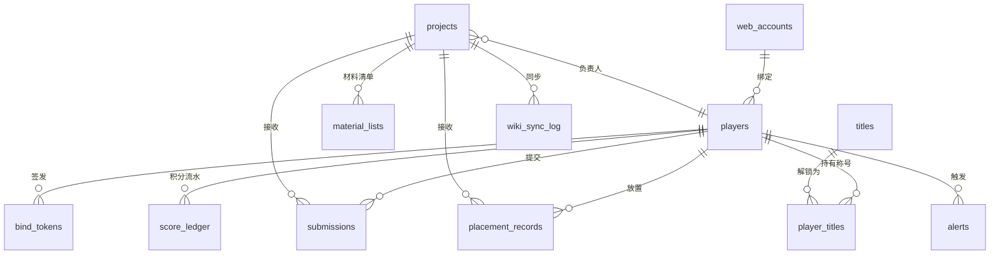

# 全局数据模型（data-model）

> **统一总览**：[`../architecture.md`](../architecture.md) §6
> 本文档定义后端唯一数据库 **PostgreSQL** 的全部表结构、约束与索引。
> 模块化单体内按 **schema 隔离**各领域模块（部署仍是单库）。

## 0. 设计约定

- **玩家主键 = MC UUID**（离线模式 OfflinePlayer 确定性推导，见 [`services/user-service.md`](./services/user-service.md)）。`UUID` 类型为 PostgreSQL 原生 `uuid`。
- **身份主锚 = MC UUID**（R-5）：当前实现以 `players.uuid` 为身份锚；Web 账号绑定（`web_accounts` / `players.web_account_id`）为**规划中**（见 §2.4，未落地），落地后离线改名通过更新映射做过户，不丢积分。
- **物品 id = registry id**：统一 `namespace:path`（如 `create:warehouse`、`minecraft:chest`），存储前剥离 BlockState properties。
- **时间戳**：`TIMESTAMPTZ`，统一存 UTC。
- **积分流水 append-only**：任何积分变动写一条 `score_ledger`，含 `balance_after`，可审计与重建榜单（**规划中**，未落地）。
- **schema 划分与实现状态**：
  - ✅ **已实现**：`users`（`players` / `auth_tokens` / `jwt_revocations`，迁移 0001-0003 + 0011，§2）、`sheets`（`sheets` / `sheet_rows` / `sheet_row_contributors`，迁移 0004/0005/0007/0008/0009/0010，§10）、`notifications`（`notifications`，迁移 0006，§11）
  - 🚧 **规划中（未落地）**：`projects` / `scoring` / `titles` / `wiki` / `alerts`（原架构 6 schema 中的 5 个，§3-§7 为设计预案）；`web_accounts` / `bind_tokens`（§2.4/§2.5，`!!bind` 流程）

## 1. 全局 ER 图



---

## 2. `users` schema —— 身份核心

### 2.1 `players`（玩家）✅ 已实现（迁移 `0001_users_players` + `0011_players_last_sheet_id`）
| 列 | 类型 | 约束 | 说明 |
|---|---|---|---|
| `uuid` | uuid | PK | MC OfflinePlayer UUID（身份锚 R-5） |
| `current_name` | varchar(64) | not null | 当前游戏名（离线改名会变） |
| `role` | varchar(16) | not null default 'user' | user / admin / owner（RBAC） |
| `whitelist_state` | varchar(16) | not null default 'active' | active / under_review / removed |
| `first_seen_at` | timestamptz | not null default now() | 首次入服 |
| `last_seen_at` | timestamptz | not null default now() | 最近在线 |
| `last_sheet_id` | integer | null（迁移 0011） | 玩家最后查看的 sheet id（best-effort：`GET /sheets/{id}` JSON 详情路径写入；csv 导出与 404 不记）。**故意无 FK**——表被删后自然失效（下次查看任意表覆盖），对齐 `sheet_rows.registry_id` 先例；**无索引**（只按 PK `uuid` 单行查/写，`last_sheet_id` 无独立查询用途） |

> 规划列（**未实现**，依赖对应 schema 落地后补）：`web_account_id`（FK→web_accounts.id，§2.4）、`total_score`（冗余累计积分，由 score_ledger 重建，§4）、`current_title_id`（FK→titles.id，§5）、`credit_score`（负责人信用分）。

### 2.2 `auth_tokens`（一次性登录令牌）✅ 已实现（迁移 `0002_auth_jwt` + `0003_auth_tokens_revoked_at`）

`!!PCH login` 链路：MCDR 调 `POST /auth/token` 签发 → 玩家 Web 端 `POST /auth/exchange` 兑换 JWT 后置 `used_at`。

| 列 | 类型 | 约束 | 说明 |
|---|---|---|---|
| `token` | uuid | PK | 一次性随机 token（URL 携带） |
| `player_uuid` | uuid | FK→players.uuid, not null | 申请登录的玩家 |
| `expires_at` | timestamptz | not null | 短有效期（默认 10 分钟） |
| `used_at` | timestamptz | null | 已兑换时间（一次性语义，兑换后置位） |
| `revoked_at` | timestamptz | null | 软吊销时间（同 UUID 签发新 token 时旧 token 置位，RS-5） |
| `issued_ip` | varchar(64) | null | MCDR 端签发时记录的客户端 IP |
| `exchanged_ip` | varchar(64) | null | 前端兑换时记录的客户端 IP |
| `created_at` | timestamptz | not null default now() | |

索引：`ix_auth_tokens_player_expires (player_uuid, expires_at)`；`ix_auth_tokens_player_active ON (player_uuid) WHERE used_at IS NULL AND revoked_at IS NULL`（部分索引，"活跃 token"快速查找，迁移 0003）。

### 2.3 `jwt_revocations`（JWT 吊销表）✅ 已实现（迁移 `0002_auth_jwt`）

| 列 | 类型 | 约束 | 说明 |
|---|---|---|---|
| `jti` | uuid | PK | JWT ID（签发时生成） |
| `player_uuid` | uuid | FK→players.uuid, not null | 所属玩家 |
| `expires_at` | timestamptz | not null | JWT 自然过期时间（过期后可清理） |
| `revoked_at` | timestamptz | not null default now() | 主动吊销时间 |

索引：`ix_jwt_revocations_player_expires (player_uuid, expires_at)`。

> refresh token 吊销接入待办（当前 `POST /auth/refresh` 未查本表，源码注释标注扩展点）。

### 2.4 `web_accounts`（Web 账号）🚧 规划中（未实现）

> 计划用于 `!!bind` Web 账号绑定后的身份主锚迁移（R-5 终态）。当前身份锚是 MC UUID（§0）。表结构预案：

| 列 | 类型 | 约束 | 说明 |
|---|---|---|---|
| `id` | bigserial | PK | |
| `username` | text | unique not null | 登录名/邮箱 |
| `password_hash` | text | not null | bcrypt/argon2 |
| `role` | text | not null default 'user' | user/admin/owner |
| `created_at` | timestamptz | not null | |

### 2.5 `bind_tokens`（游戏内绑定令牌）🚧 规划中（未实现）

> 计划用于 `!!bind` 流程。当前已实现的登录令牌是 `auth_tokens`（§2.2，用于 `!!PCH login`），与本表**不是同一张表**。表结构预案：

| 列 | 类型 | 约束 | 说明 |
|---|---|---|---|
| `token` | uuid | PK | 一次性随机 token |
| `player_uuid` | uuid | FK→players.uuid, not null | 申请绑定的玩家 |
| `expires_at` | timestamptz | not null | 短有效期（如 10 分钟） |
| `used_at` | timestamptz | null | 已使用时间 |
| `created_at` | timestamptz | not null | |

索引：`idx(player_uuid)`；定期清理过期 token。

> 规划流程：玩家游戏内 `!!bind` → 生成 `bind_tokens` → 后端返回短码 → 玩家 Web 端输入 → 写 `players.web_account_id` + `used_at`。

---

## 3. `projects` schema —— 项目与材料

### 3.1 `projects`（项目）
| 列 | 类型 | 约束 | 说明 |
|---|---|---|---|
| `id` | bigserial | PK | |
| `name` | text | not null | 项目名 |
| `type` | text | not null | `COLLECT` / `BUILD_A` |
| `total_score_pool` | numeric(18,2) | not null | 固定总积分池 S_总 |
| `score_cap` | numeric(18,2) | null | 单项目兜底上限 |
| `status` | text | not null default 'draft' | draft/active/settling/archived |
| `leader_uuid` | uuid | FK→players.uuid, not null | 项目负责人 |
| `phase_meta` | jsonb | null | 阶段拆分/里程碑 |
| `litematic_path` | text | null | 已上传投影文件路径 |
| `created_at` / `archived_at` | timestamptz | | |

索引：`idx(status)`、`idx(leader_uuid)`。

### 3.2 `material_lists`（材料清单 —— 来自 .litematic 解析）
| 列 | 类型 | 约束 | 说明 |
|---|---|---|---|
| `id` | bigserial | PK | |
| `project_id` | bigint | FK→projects.id, not null | |
| `item_id` | text | not null | registry id，如 `create:warehouse` |
| `required_qty` | int | not null | 需求量 |
| `delivered_qty` | int | not null default 0 | 已交付（冗余，由 submissions 汇总） |

约束：`uniq(project_id, item_id)`。

---

## 4. `scoring` schema —— 提交、放置、流水

### 4.1 `submissions`（材料提交记录）
| 列 | 类型 | 约束 | 说明 |
|---|---|---|---|
| `id` | bigserial | PK | |
| `project_id` | bigint | FK, not null | |
| `player_uuid` | uuid | FK, not null | |
| `item_id` | text | not null | registry id |
| `qty` | int | not null | 本次提交数量 |
| `batch_token` | uuid | not null | 一次 `!!submit` 一个批次（多物品共用） |
| `status` | text | not null default 'confirmed' | confirmed/reverted |
| `submitted_at` | timestamptz | not null | |

约束：`uniq(project_id, player_uuid, item_id, batch_token)` 防重复；`idx(project_id, item_id)`、`idx(player_uuid)`。

### 4.2 `placement_records`（A 类放置贡献）
| 列 | 类型 | 约束 | 说明 |
|---|---|---|---|
| `id` | bigserial | PK | |
| `project_id` | bigint | FK, not null | |
| `player_uuid` | uuid | FK, not null | |
| `work_units` | numeric(12,2) | not null | 放置工作量（方块数/工时） |
| `source` | text | not null | 记录来源（如区域扫描/手动） |
| `recorded_at` | timestamptz | not null | |

索引：`idx(project_id, player_uuid)`。

### 4.3 `score_ledger`（积分流水 —— append-only）
| 列 | 类型 | 约束 | 说明 |
|---|---|---|---|
| `id` | bigserial | PK | |
| `player_uuid` | uuid | FK, not null | |
| `project_id` | bigint | FK, null | 关联项目（运维转移可为空） |
| `delta` | numeric(18,2) | not null | 增减（可负，如修正/回收） |
| `reason` | text | not null | submit/place/leader_bonus/manual_adj/season_reset |
| `balance_after` | numeric(18,2) | not null | 变更后余额 |
| `operator` | text | null | 手动修正时的操作者 |
| `created_at` | timestamptz | not null | |

索引：`idx(player_uuid, created_at desc)`、`idx(project_id)`、`idx(reason)`。**禁止 UPDATE/DELETE**（由权限/触发器保证）。

---

## 5. `titles` schema —— 称号体系

### 5.1 `titles`（称号定义）
| 列 | 类型 | 约束 | 说明 |
|---|---|---|---|
| `id` | bigserial | PK | |
| `code` | text | unique not null | 程序标识 |
| `name` | text | not null | 显示名 |
| `tier` | int | not null | 阶位（1 起） |
| `base_score` | numeric(14,2) | not null | S_基 |
| `growth_r` | numeric(6,3) | not null | 增长系数 r |
| `required_score` | numeric(14,2) | not null | 解锁所需积分 `S_基×r^(tier-1)` |
| `prefix_text` | text | null | 聊天前缀文本（scoreboard 用） |
| `is_high_tier` | bool | not null default false | 是否触发全服公告 / wiki 权益 |
| `announce_on_unlock` | bool | not null default true | |

### 5.2 `player_titles`（玩家已解锁称号）
| 列 | 类型 | 约束 | 说明 |
|---|---|---|---|
| `player_uuid` | uuid | FK, PK | |
| `title_id` | bigint | FK, PK | |
| `unlocked_at` | timestamptz | not null | |
| `is_active` | bool | not null default false | 当前是否展示 |

约束：复合 PK `(player_uuid, title_id)`；每玩家至多一条 `is_active=true`（部分唯一索引）。

---

## 6. `wiki` schema —— wiki.js 同步

### 6.1 `wiki_sync_log`（同步日志 / 幂等表）
| 列 | 类型 | 约束 | 说明 |
|---|---|---|---|
| `id` | bigserial | PK | |
| `entity_type` | text | not null | project_archive/leaderboard/page_rule/user_group |
| `entity_id` | text | not null | 关联业务实体 |
| `wiki_page_id` | int | null | wiki.js 页面 id |
| `action` | text | not null | create/update/delete/grant/revoke |
| `status` | text | not null | pending/done/failed |
| `payload` | jsonb | null | 请求快照 |
| `error` | text | null | 失败原因 |
| `synced_at` | timestamptz | not null | |

索引：`idx(entity_type, entity_id)`、`idx(status)`。失败可重试，幂等靠 `entity_type+entity_id+action`。

---

## 7. `alerts` schema —— 风控告警

### 7.1 `alerts`（异常事件）
| 列 | 类型 | 约束 | 说明 |
|---|---|---|---|
| `id` | bigserial | PK | |
| `type` | text | not null | score_spike/behavior_abuse/manual |
| `player_uuid` | uuid | FK, null | |
| `project_id` | bigint | FK, null | |
| `severity` | text | not null | low/medium/high |
| `message` | text | not null | |
| `evidence` | jsonb | null | 触发依据（数值快照） |
| `status` | text | not null default 'new' | new/ack/resolved |
| `created_at` | timestamptz | not null | |

索引：`idx(status, created_at)`、`idx(player_uuid)`。

---

## 8. 关键查询模式（索引依据）

- **占比结算**（收集类 `S_i = S_总 × n_i/N_总`）：窗口函数 `SUM(qty) OVER (PARTITION BY project_id, item_id)`。
- **A 类贡献度** `G = α(t/T)+β(p/P)`：分别聚合 `placement_records`（t）与 `submissions`（p）占比，加权。
- **榜单**：`players.total_score` 排序 + 赛季窗口（按 `score_ledger.created_at` 范围重算）。
- **进度监控**：`material_lists.delivered_qty / required_qty`。

## 9. 迁移与种子

- 使用 **Alembic** 管理迁移；每个 schema/模块一组迁移脚本。
- 种子数据：`titles` 的初始梯度、`web_accounts` 的初始管理员。
- 所有迁移**可重入**，回滚脚本必填。

> 待确认：负责人系数 `k` 分档、A 类 `α/β`、称号 `S_基/r` 的具体数值，由配置表或环境变量注入（不硬编码）。

---

## 10. ✅ 已实现 schema 附录：`sheets` —— 在线协作表格

> MVP 第一阶段新增（不在原架构 6 schema 内），权威定义见 [`../../Plans/MVP-第一阶段计划.md`](../../Plans/MVP-第一阶段计划.md) §3.2，落地迁移 `0004_sheets`。与 `projects.material_lists`（投影解析、强制 registry id）是**两套体系**：sheets 是玩家自建、自由文本、Web + 游戏内双向可编辑的轻量协作表。

### 10.1 `sheets`（表格主表）
| 列 | 类型 | 约束 | 说明 |
|---|---|---|---|
| `id` | bigserial | PK | |
| `owner_uuid` | uuid | FK→players.uuid, not null | 表主（身份锚 R-5） |
| `title` | text | not null | 表标题 |
| `status` | text | not null default 'collecting', CHECK ∈ (collecting/constructing/archived)（迁移 0009） | **项目阶段**：collecting（材料收集，默认）/ constructing（施工占位）/ archived（只读终态），见 §10.4 |
| `archived_path` | text | null（仅 archived 非空，一致性 CHECK） | 归档产物相对 `ARCHIVE_ROOT` 的 POSIX 路径（如 `projects/42/index.md`，每项目独立文件夹，同目录含 `contributions.png` 占比饼图）；wiki-service git 双向同步入口 |
| `archived_at` | timestamptz | null（仅 archived 非空，一致性 CHECK） | 归档时间 |
| `created_at` / `updated_at` | timestamptz | not null default now() | |

约束（迁移 0009）：`ck_sheets_status_values`（status ∈ collecting/constructing/archived）+ `ck_sheets_status_archive_consistency`（`status='archived' ⇒ archived_path/archived_at 非空`；`status ∈ (collecting,constructing) ⇒ 二者 null`）。索引：`ix_sheets_status`。`status` 用 `server_default='collecting'` 自动回填现有行（无额外 UPDATE）。

### 10.2 `sheet_rows`（表格行）
| 列 | 类型 | 约束 | 说明 |
|---|---|---|---|
| `id` | bigserial | PK | |
| `sheet_id` | bigint | FK→sheets.id `ON DELETE CASCADE`, not null | 删表级联删行 |
| `item_name` | text | not null | 显示名/自由文本（红线 R-6 不覆盖 sheets）；新建时若缺失，后端据 `registry_id` 用翻译表自动补中文名 |
| `registry_id` | text | null | MC 物品注册名 `namespace:path`（隐式可空，迁移 0010）；**一键提交按此精确匹配表行**；block id ≠ item id 时存原值（不归一化，见 mcdr-plugin §6） |
| `need_qty` | integer | not null default 0 | 原始整数，永不存换算结果 |
| `mode` | smallint | not null default 0 | 0=lock（二元备齐，单人锁定）/ 1=progress（进度，多人贡献者列表） |
| `status` | text | not null default 'open' | open / claimed / done（见下不变量） |
| `claimant_uuid` | uuid | FK→players.uuid, null | lock 模式当前认领人（open 态 null）；**progress 模式恒 null** |
| `delivered_qty` | integer | not null default 0 | lock 认领人维护；progress 任何人 `contribute` 累加 |
| `sort_order` | integer | not null default 0 | |
| `updated_at` | timestamptz | not null default now() | |
| `parent_row_id` | bigint | FK→sheet_rows.id `ON DELETE CASCADE`, null（迁移 0012）| **子物品嵌套**：子行的父行 id；null = 顶层行。删父行级联删子行（ON DELETE CASCADE） |
| `qty_per_unit` | integer | null（迁移 0012）| **子物品单位用量**：子行每个父行物品所需的子物品数量。仅子行非空且≥1；need_qty = qty_per_unit × 父行 need_qty（派生存储，父行 need 变动时级联重算） |

约束（迁移 0012）：
- **单层限制**：子行只能挂顶层行下（`parent_row_id IS NULL OR parent.parent_row_id IS NULL`，由 repo 层校验）
- **部分唯一索引**（替换原 `UNIQUE(sheet_id, item_name)`）：
  - `uq_sheet_rows_top_name`：`UNIQUE(sheet_id, item_name) WHERE parent_row_id IS NULL`（顶层行按 sheet_id+item_name 唯一）
  - `uq_sheet_rows_sub_registry`：`UNIQUE(parent_row_id, registry_id) WHERE parent_row_id IS NOT NULL`（子行按父行+registry_id 唯一）
- **CHECK** `ck_sheet_rows_sub_invariants`：`parent_row_id IS NULL OR (registry_id IS NOT NULL AND qty_per_unit IS NOT NULL AND qty_per_unit >= 1)`（子物品必须有 registry_id 且 qty_per_unit≥1）
- 索引：`ix_sheet_rows_parent (parent_row_id) WHERE parent_row_id IS NOT NULL`（子行查询）
- 索引：`idx(sheet_id)`、`idx(sheet_id, status)`（迁移 0005）。`registry_id` 为 nullable、无唯一约束，仅作「一键提交」匹配键（迁移 0010）。

**子物品不变量**（迁移 0012，issue #19）：
- **单层**：子物品只能挂顶层行下，禁止多层嵌套（repo 层 `parent.parent_row_id IS NULL` 校验）
- **模式继承**：父行 lock→子行只能 lock；父行 progress→子行可 lock/progress，默认继承父行模式
- **单位用量级联**：子行 `need_qty = qty_per_unit × 父行 need_qty`（派生存储，非用户输入；父行 need/mode 变动时级联重算子行）
- **级联删除**：删父行自动删所有子行（ON DELETE CASCADE）
- **状态机复用**：子行复用整条 `sheet_rows` 状态机（lock/progress、claim/deliver/contribute），传子 `row_id` 即可

**双模式不变量**（迁移 0005 协作改进 + 0007 progress 多人贡献者，推翻原 spec D-4）：
- **lock（mode=0）**：单认领人状态机 `open → claimed → done`（claim / delivery / release / reject）；`open ⇒ claimant IS NULL ∧ delivered=0`，`claimed ⇒ claimant NOT NULL`，`done ⇒ claimant NOT NULL ∧ delivered≥need`。
- **progress（mode=1）**：`claimant_uuid` **恒 null**（不锁定单人）；`status` 由 `delivered_qty` 推导（`=0 → open` / `0<x<need → claimed` / `>=need → done`）；贡献者走 `sheet_row_contributors` 子表，任何人 `POST /contribute`（增量累加、幂等加入）。`claim/delivery/reject` 对 progress 行 → 409；owner `release` 清 delivered + 贡献者重置。

### 10.3 `sheet_row_contributors`（progress 行贡献者，迁移 0007 + 0008）
| 列 | 类型 | 约束 | 说明 |
|---|---|---|---|
| `id` | bigserial | PK | |
| `row_id` | bigint | FK→sheet_rows.id `ON DELETE CASCADE`, not null | 删行级联清贡献者 |
| `player_uuid` | uuid | FK→players.uuid, not null | 贡献者身份锚（R-5） |
| `joined_at` | timestamptz | not null default now() | 首次上交时间 |
| `contributed_qty` | integer | not null default 0（迁移 0008 加） | 该玩家对该行的**历史累计上交量**；每次 `contribute` 增量累加（append-only），owner 调进度（`PATCH /progress`）**不改它** |

约束：`UNIQUE(row_id, player_uuid)`（同一玩家对同一行只一条记录）。`contribute_row` 用 `INSERT ... ON CONFLICT (row_id, player_uuid) DO UPDATE SET contributed_qty = contributed_qty + <本次qty>` 幂等加入并按人累加（**非** `DO NOTHING`——`DO NOTHING` 会丢量）。仅 progress（mode=1）行写入；lock 行不用本表。

> **与 `sheet_rows.delivered_qty` 解耦（重要）**：`delivered_qty` 是 owner 可修正的**当前进度**（绝对值覆写，可增可减）；`contributed_qty` 是每位玩家**历史累计上交**（只增）。因此 `Σ contributed_qty` **可能 ≠ `delivered_qty`**——owner 一旦手动调过进度，二者就会漂移（属预期，不是 bug：贡献者统计保留历史，进度条反映当前）。
>
> **排序**：`list_contributors` 按 `contributed_qty DESC, joined_at, id` 返回贡献者名单（贡献多者在前）。**注意（已知缺口）**：当前该列只用于排序，`list_contributors` 的 SELECT 与响应 schema `RowContributor` 均**未带出 `contributed_qty`** → 客户端只拿到排好序的名字列表、看不到每人具体量；归档统计 `aggregate_contributor_totals` 则会用到（见 §10.4）。

> **权限（RBAC，后端为准）**：JWT 已登录可读所有表；表的 `owner_uuid` 或 admin/owner 角色可写；CSV 全量导出 `GET /sheets/export` 走 service token（外部读取硬约束，MVP §4）。
> **数量换算 `format_qty`**（个/组/盒，STACK=64/SHULKER=1728）是显示层纯函数，不入库、不进 API 响应（前端 `utils/qty.ts` 与后端 `core/qty.py` 对齐）。

### 10.4 项目生命周期状态机（迁移 0009）

> 与 §10.2「行级双模式不变量」**正交**：行级 `status`（open/claimed/done）描述单条物品的认领协作；项目级 `status`（collecting/constructing/archived）描述整个 sheet（项目）的生命周期。

```
   advance(to=constructing)        advance(to=archived，写盘+通知)
collecting ─────────────────────▶ constructing ─────────────────────▶ archived
    └────────── advance(to=archived，跳过施工，写盘+通知) ──────────────▶▲
```

| 转移 | 触发者 | 副作用 |
|---|---|---|
| collecting → constructing | owner/admin | 仅置 `status=constructing`（静默，不发通知） |
| collecting → archived（直跳） | owner/admin | 渲染 md → 原子写盘 → DB 置 archived 三字段 + `sheet_archived` 通知 → commit |
| constructing → archived | owner/admin | 同上（标记施工完成并归档） |

**不变量**：
- `archived` = **终态只读**——repo 层 `_assert_writable` 守卫：archived 之后任何写操作（行级 upsert/claim/delivery/contribute/release/reject/progress、删行、删表、advance）抛 `SheetArchived` → api 翻译 409。archived 后行数据视为**冻结**（无 DB 触发器，应用层守卫；admin 直连改行会使归档 md 过期，文档标注此风险）。
- 一致性 CHECK `ck_sheets_status_archive_consistency` 保证：`archived ⇔ archived_path + archived_at 非空`；`collecting/constructing ⇔ 二者 null`。
- `advance(to=当前状态)` 幂等拒绝 → `SheetRowConflict` → 409（避免重复通知/覆盖 archived_at）。
- 并发：`advance_sheet` 用 `SELECT ... FOR UPDATE` 锁 sheet 行。

**归档文件路径约定**：`archived_path` 存相对 `ARCHIVE_ROOT` 的 POSIX 路径，指向**每项目独立文件夹**下的 `index.md`（`projects/{sheet_id}/index.md`），同目录还含 `contributions.png`（matplotlib 渲染的贡献占比饼图，CJK 字体 Noto Sans CJK SC；≤5 人全显，>5 人 top5 + 其他）。文件夹覆盖（archived 终态不重归档，`{sheet_id}` 稳定可预测）。这是 **wiki-service git 双向同步入口**（后端 publisher 把 `projects/<id>/` 整目录提交推送到独立 wiki 内容 git 仓；默认 off，红线 R-8）。

**归档 markdown section 结构**（去逐行材料清单）：

- `# 📦 项目归档：{title}` —— 标题
- `## 🏆 贡献者统计` —— `aggregate_contributor_totals` 用 union_all 把 lock 行 `delivered_qty`（按 claimant）+ progress 行 `contributed_qty`（按贡献者）合并按人聚合，`HAVING SUM > 0` 剔除零和，输出精确排行
- `## 📊 贡献占比` —— 引用同目录 ``（PNG 饼图）
- `## 📅 时间线` —— 收集/施工/归档阶段时间戳
- footer：`由 PCHSystem 自动生成`

---

## 11. ✅ 已实现 schema 附录：`notifications`（迁移 `0006_notifications`）

> 统一通知抽象层：业务事件同事务写入 → MCDR 轮询投递。调用契约与 category 枚举见 [`services/notification-service.md`](./services/notification-service.md)；端点见 [`api/sheets.md`](./api/sheets.md) §12。

### 11.1 `notifications`（通知记录）
| 列 | 类型 | 约束 | 说明 |
|---|---|---|---|
| `id` | bigserial | PK | |
| `recipient_uuid` | uuid | FK→players.uuid `ON DELETE CASCADE`, not null | 收件人（玩家身份锚 R-5）；删玩家级联清通知 |
| `category` | text | not null | `<domain>_<event>`（首期 7 类 sheets 专用，见 notification-service.md §3） |
| `title` | text | not null | 标题（≤200，入库前限长清洗） |
| `body` | text | not null | 正文（≤500，入库前限长清洗） |
| `payload` | jsonb | not null default '{}'::jsonb | 结构化载荷（≤8KB），如 `{sheet_id, sheet_title, row_id, item_name, actor_uuid, actor_name, old, new}` |
| `created_at` | timestamptz | not null default now() | 写入时间（投递排序依据） |
| `delivered_at` | timestamptz | null | MCDR `POST /ack` 后置位（null = 未投递） |
| `read_at` | timestamptz | null | 玩家标已读后置位 |

索引：`ix_notifications_recipient_delivered (recipient_uuid, delivered_at)`（服务 MCDR `GET /pending` 轮询拉取 `delivered_at IS NULL`）。

> 投递/已读端点（`GET /pending` / `POST /ack` / `POST /{id}/read`）均带 `player_uuid` 归属校验防越权（C-1，见 [`api/sheets.md`](./api/sheets.md) §12）。
