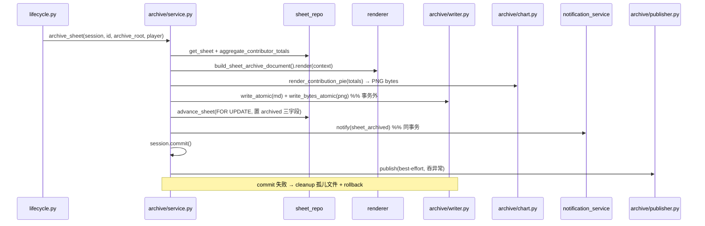

<!-- omit in toc -->
# 归档文档生成 · 端到端流程指南

> 本文件是归档层的**二次开发指南**：讲清「项目归档那一刻发生了什么」+「想改归档输出该动哪里」。
> 顶层索引见 [`../../architecture.md`](../../architecture.md) §7；红线见根 [`../../../CLAUDE.md`](../../../CLAUDE.md) §3 与 [`../../../Backend/CLAUDE.md`](../../../Backend/CLAUDE.md) RS-10/RS-11。

**读者**：想把归档 markdown 加一节 / 改默认文案 / 换图表后端 / 接 wiki 仓的二次开发者。

**状态**：✅ 已实现（迁移 0009，2026-07-03）。本指南§7 含三条**未执行**的改造路线（接线死代码 / ChartRenderer Protocol / helper 库），作为后续动手清单。

---

- [1. 一句话定位](#1-%E4%B8%80%E5%8F%A5%E8%AF%9D%E5%AE%9A%E4%BD%8D)
- [2. 端到端流程](#2-%E7%AB%AF%E5%88%B0%E7%AB%AF%E6%B5%81%E7%A8%8B)
- [3. 核心抽象：markdown\_render Route C](#3-%E6%A0%B8%E5%BF%83%E6%8A%BD%E8%B1%A1markdownrender-route-c)
  - [SectionRenderer Protocol（protocols.py）](#sectionrenderer-protocolprotocolspy)
  - [TemplateSection / FunctionSection（sections.py）](#templatesection--functionsectionsectionspy)
  - [MarkdownDocument（document.py）](#markdowndocumentdocumentpy)
- [4. 首个消费者：sheet 归档 renderer](#4-%E9%A6%96%E4%B8%AA%E6%B6%88%E8%B4%B9%E8%80%85sheet-%E5%BD%92%E6%A1%A3-renderer)
- [5. 落盘与事务一致性](#5-%E8%90%BD%E7%9B%98%E4%B8%8E%E4%BA%8B%E5%8A%A1%E4%B8%80%E8%87%B4%E6%80%A7)
- [6. wiki 推送（可选副产物）](#6-wiki-%E6%8E%A8%E9%80%81%E5%8F%AF%E9%80%89%E5%89%AF%E4%BA%A7%E7%89%A9)
- [7. 二次开发指南](#7-%E4%BA%8C%E6%AC%A1%E5%BC%80%E5%8F%91%E6%8C%87%E5%8D%97)
  - [7.1 加一个新 section（最常见）](#71-%E5%8A%A0%E4%B8%80%E4%B8%AA%E6%96%B0-section%E6%9C%80%E5%B8%B8%E8%A7%81)
  - [7.2 覆盖默认文案 · 接线死代码（改造路线，未执行）](#72-%E8%A6%86%E7%9B%96%E9%BB%98%E8%AE%A4%E6%96%87%E6%A1%88--%E6%8E%A5%E7%BA%BF%E6%AD%BB%E4%BB%A3%E7%A0%81%E6%94%B9%E9%80%A0%E8%B7%AF%E7%BA%BF%E6%9C%AA%E6%89%A7%E8%A1%8C)
  - [7.3 换图表渲染器 · ChartRenderer Protocol（改造路线，未执行）](#73-%E6%8D%A2%E5%9B%BE%E8%A1%A8%E6%B8%B2%E6%9F%93%E5%99%A8--chartrenderer-protocol%E6%94%B9%E9%80%A0%E8%B7%AF%E7%BA%BF%E6%9C%AA%E6%89%A7%E8%A1%8C)
  - [7.4 helper 库（改造路线，未执行）](#74-helper-%E5%BA%93%E6%94%B9%E9%80%A0%E8%B7%AF%E7%BA%BF%E6%9C%AA%E6%89%A7%E8%A1%8C)
- [8. 红线速查](#8-%E7%BA%A2%E7%BA%BF%E9%80%9F%E6%9F%A5)


## 1. 一句话定位

项目进入终态 `archived` 时，后端把 sheet + 贡献排行渲染成一份 markdown（`index.md`）+ 一张贡献占比图（`contributions.png`），原子写到 `ARCHIVE_ROOT/projects/{id}/`，DB 置归档三字段，通知 owner，最后（可选）推送到 wiki git 仓。**业务库永远是权威源（R-1）；归档产物是人类可读的投影。**

---

## 2. 端到端流程

入口：`POST /sheets/{id}/advance?to=archived`（owner/admin，[`../api/sheets.md`](../api/sheets.md) §5.2）。读到归档态用 `GET /sheets/{id}/archive`（`text/markdown`），资产用 `GET /sheets/{id}/archive/assets/{filename}`。



`archive_sheet()`（[`../../../Backend/app/services/archive/service.py`](../../../Backend/app/services/archive/service.py)）的 7 步：

| # | 步骤 | 失败处理 |
|---|---|---|
| 1 | `get_sheet` + owner_name | None → `SheetNotFoundError` → api 404 |
| 2 | 预检 status（archived → 409；非 collecting/constructing → 409）| 早期友好失败 |
| 3 | `aggregate_contributor_totals`（lock 交付 + progress 上交合并按账号）| — |
| 4 | build context + `render(md)` + `render_contribution_pie` | 纯函数，不查库 |
| 5 | `write_atomic` + `write_bytes_atomic`（**事务外**）| 任一步失败 → cleanup 已写文件 + raise |
| 6 | `try:` advance_sheet（FOR UPDATE）+ notify + commit；`except:` cleanup + rollback + raise | 并发归档第二个 → `SheetArchived` 上抛 → cleanup |
| 7 | post-commit `publisher.publish`（best-effort）| 任何异常吞掉，仅 `logger.exception` |

**顺序理由**（写进 service docstring）：文件是可清理副产物；**先写盘后 commit**——commit 失败可清文件（孤儿无害），反之 DB 显 archived 但文件缺失更糟（GET /archive 404 且无补救）。

---

## 3. 核心抽象：markdown_render Route C

通用结构化 markdown 渲染，4 件套（[`../../../Backend/app/services/markdown_render/`](../../../Backend/app/services/markdown_render/)），**零依赖**（RS-11，不引 Jinja2）。

### SectionRenderer Protocol（protocols.py）

```python
MarkdownContext = Mapping[str, Any]  # 扁平 dict，调用方预算后注入

@runtime_checkable
class SectionRenderer(Protocol):
    name: str          # 分节唯一标识（同名 override 的键）
    order: int         # 文档内位置（升序渲染；同 order 注册顺序兜底）
    def render(self, context: MarkdownContext) -> str: ...  # 空串/纯空白被文档层过滤
```

与 `Notifier` Protocol 同范式（RS-9）——「注册式扩展点」是本项目的统一抽象风格。

### TemplateSection / FunctionSection（sections.py）

两者皆 `@dataclass(frozen=True)`（不可变，项目编码规范）。

```python
@dataclass(frozen=True)
class TemplateSection:        # 静态文案（header / status_line / meta / footer）
    name: str; order: int; template: str
    # render 用 str.format_map；缺 key → 空串 + warning 不抛；None → 空串
    # 字面 { } 需写成 {{ }}（标准库约定）

@dataclass(frozen=True)
class FunctionSection:        # 动态内容（表格 / 排行 / 时间线）
    name: str; order: int; func: Callable[[MarkdownContext], str]
    # 循环/条件/空处理写在纯 Python 函数里——Route C 核心取舍：
    # 不靠占位符引擎把逻辑推给模板
```

`TemplateSection` 的 `_SafeFormatDict`：`format_map` 遇缺 key 抛 `KeyError`，用兜底 Mapping 让缺 key 渲染空串并去重记一次 warning（缺字段渲染空，比中断整篇归档稳健）。

### MarkdownDocument（document.py）

```python
@dataclass(frozen=True)
class MarkdownDocument:
    _sections: tuple = ()                    # tuple 保 frozen 可哈希
    def register(self, section) -> MarkdownDocument: ...   # 返回新对象，同名 override
    def register_many(self, sections) -> MarkdownDocument: ...
    def render(self, context=None) -> str: ...             # 按 order 稳定排序 + 过滤空白 + \n\n join
```

**不可变**：`register` 返回新实例（移除同名旧 section + 追加新 section），绝不就地改。

---

## 4. 首个消费者：sheet 归档 renderer

[`renderer.py::build_sheet_archive_document()`](../../../Backend/app/services/archive/renderer.py) 链式 register 6 个内置 section + footer：

| order | name | 类型 | 内容 |
|---|---|---|---|
| 100 | header | Template | `# 📦 项目归档：{title}` |
| 200 | status_line | Template | `**状态**：{status_label}` |
| 300 | meta | Template | 拥有者 / 创建 / 归档时间 |
| 500 | contributor_stats | Function | 贡献者精确排行 |
| 550 | contribution_chart | Function | 贡献占比图（引用 `contributions.png`）|
| 600 | timeline | Function | 创建 / [进入施工] / 归档时间线 |
| 900 | footer | Template | `由 PCHSystem 自动生成` |

**context dict 契约**（service 注入，renderer 是纯函数不查库）：

```python
{
    "sheet_id": int, "title": str, "owner_name": str,
    "status_label": "已归档",
    "created_at": datetime | None, "archived_at": datetime,
    "constructing_at": datetime | None,   # 当前模型未单独记录，保持 None
    "contributor_totals": [(uuid, display_name, qty)],  # 已排序汇总
}
```

**数据源**：`sheet_repo.aggregate_contributor_totals(session, sheet_id)`（[`sheet_repo.py:934`](../../../Backend/app/repositories/sheet_repo.py)）—— lock 行取 `delivered_qty`、progress 行取 `contributed_qty`，按 `web_account_id` 归并（R-5 账号锚），剔除零和，按总量降序、名字升序兜底。`display_name` = 自定义昵称优先，否则账号下最近活跃 UUID 游戏名。

---

## 5. 落盘与事务一致性

[`writer.py`](../../../Backend/app/services/archive/writer.py) 三职责 + 三不变量：

| 函数 | 职责 |
|---|---|
| `write_atomic(root, sheet_id, md)` | 原子写 `projects/{id}/index.md`，返回相对 POSIX 路径 |
| `write_bytes_atomic(root, sheet_id, filename, data)` | 原子写二进制产物（`contributions.png`），filename 必须 basename |
| `read_archive_file` / `read_archive_bytes` | 按相对路径读回（GET /archive 用），不存在 → None |
| `cleanup(root, rel_path)` | 删目标文件（回滚清孤儿），FileNotFoundError 静默 |

**不变量**：
- **路径穿越防护**：所有解析后绝对路径必须落在 `archive_root.resolve()` 之内（`is_relative_to`），否则 `ValueError`——保护 symlink / 异常 root
- **原子写**：先写 `<root>/.tmp/{id}.index.md.{pid}`，再 `os.replace` 到目标（同文件系统原子替换）
- **文件系统不参与 DB 事务**：commit 失败由 service 层调 `cleanup` 清孤儿

`archive_root` 空串 → `ArchiveNotConfigured` → api 503（不 fail-fast 阻塞其他端点）。

---

## 6. wiki 推送（可选副产物）

[`publisher.py::publish()`](../../../Backend/app/services/archive/publisher.py)：归档 commit 成功后，把 `projects/<id>/` 整目录 `git add + commit + push` 到独立 wiki 内容 git 仓（R-8）。

三条铁律（写进模块 docstring）：
1. **默认 off**：`cfg.wiki_git_remote_url` 空串 → 立即 return，不 `git init`、不报错
2. **best-effort**：任一 git/subprocess/IO 失败**不向上抛、不回滚 DB**（归档已 commit，wiki 同步失败不能让已成功的归档倒退），失败仅 `logger.exception` + 给 owner 发 `wiki_publish_failed` 通知
3. **token 不落盘**：`git config remote.origin.url` 只存不含 token 的 remote_url；推送时构造一次性 tokenized URL 直接传 `git push`（GitHub 用 `x-access-token`、Gitea/GitLab 用 `oauth2`）；日志/通知前 `_scrub_token` 脱敏（R-11）

config：`WIKI_GIT_REMOTE_URL` / `WIKI_GIT_BRANCH`（默认 main）/ `WIKI_GIT_TOKEN` / `WIKI_GIT_AUTHOR_NAME` / `WIKI_GIT_AUTHOR_EMAIL`。

---

## 7. 二次开发指南

### 7.1 加一个新 section（最常见）

例：归档正文加一节「材料清单摘要」。三步：

1. 写纯函数（renderer.py）：
```python
def render_material_summary(context: MarkdownContext) -> str:
    rows = context.get("material_rows") or []
    if not rows:
        return ""                      # 空数据返空串 → section 被文档层过滤
    lines = ["## 📋 材料摘要"]
    for r in rows:
        lines.append(f"- {r['name']}：{r['delivered']}/{r['need']}")
    return "\n".join(lines)
```
2. 在 `build_sheet_archive_document()` 链里 `.register(FunctionSection("material_summary", 450, render_material_summary))`（order 插在 contributor_stats 前）
3. service `_build_context` 补 `"material_rows": [...]`（从 sheet_rows 查）；加测试

**要点**：FunctionSection 的循环/条件/空处理写在函数里；order 决定位置；name 唯一（同名会 override）。

### 7.2 覆盖默认文案 · 接线死代码（改造路线，未执行）

**现状（死代码）**：`config.py:59 markdown_fragments_dir` + `loaders.py::load_template_sections_from_dir`（带完整测试）都在，但 `build_sheet_archive_document()` 硬编码所有 section、`archive_sheet()` 也不读该配置 —— **全仓零调用方**。`loaders` 支持 `{"name", "order", "template"}` JSON 加载静态 TemplateSection，逐个容错（失败 `warning` 跳过）。

**目标**：让产品/运营往目录丢 JSON 覆盖 header/footer 等静态文案，不动代码。

**步骤**：
1. 改签名 `build_sheet_archive_document(fragments_dir: str = "") -> MarkdownDocument`（`service.py:129` 调用处传 `cfg.markdown_fragments_dir`）
2. 函数链尾接 loader：
```python
doc = MarkdownDocument().register(...)...  # 内置默认
if fragments_dir:
    overrides = load_template_sections_from_dir(Path(fragments_dir))
    doc = doc.register_many(overrides)     # 同名 override 由 register 保证
return doc
```
3. JSON 格式（loaders 已定）：`{"name": "header", "order": 100, "template": "# 📦 {title}"}` —— **name 必须匹配内置 section name 才能覆盖**；order 用 JSON 自带值（可同时改文案与位置）
4. 测试：`test_archive_service.py` 加「fragments_dir 有 header.json → 渲染含覆盖文案 / 目录不存在 → 内置默认不报错」
5. `.env.example` 的 `MARKDOWN_FRAGMENTS_DIR` 注释从「待接线」改「生效中」

**边界**：仅静态 TemplateSection 可覆盖；动态 FunctionSection 无法序列化为 JSON，仍需改代码（见 7.1）。

### 7.3 换图表渲染器 · ChartRenderer Protocol（改造路线，未执行）

**现状**：`chart.py::render_contribution_pie(totals) -> bytes` 是裸函数（matplotlib Agg + CJK 字体 Noto Sans CJK SC + top5+其他聚合），`service.py:131` 直接调用。换图表后端（SVG / 无 matplotlib 轻量方案 / echarts 静态）需改 service 调用点。

**目标**：抽 `ChartRenderer` Protocol（同 Notifier/SectionRenderer 范式），换后端 = 注册新实现。

**步骤**：
1. 加 Protocol（建议放 `archive/protocols.py`，与 markdown_render 解耦——图表是归档特有，非通用渲染）：
```python
@runtime_checkable
class ChartRenderer(Protocol):
    filename: str   # 产物 basename，如 "contributions.png"
    def render(self, totals: Sequence[tuple[UUID, str, int]]) -> bytes: ...
```
2. `chart.py` 改 `class MatplotlibPieChart:` 实现 Protocol（`filename = CHART_FILENAME`，`render` 原 `render_contribution_pie` 逻辑），惰性 import matplotlib 留在实现层（**不污染抽象层**，RS-11）
3. `service.py:131` 改 `chart_png = chart_renderer.render(contributor_totals)`，renderer 经 config/DI 注入（默认 `MatplotlibPieChart()`）；`filename` 从 renderer 读，去硬编码 `CHART_FILENAME`
4. 测试：`test_archive_service.py` 注入 fake renderer（返 `b"PNG"`）验证调用契约，不依赖 matplotlib

### 7.4 helper 库（改造路线，未执行）

**现状**：`render_contributor_stats`（renderer.py:109）手写 `f"{pos}. {name} — {qty}"` 列表；`render_timeline` 手写条件行；`render_contribution_chart` 手写图片引用。每个 FunctionSection 都重复「空数据返空串 + 循环拼行」样板。

**目标**：`markdown_render/helpers.py` 提供 4 个纯函数，让 FunctionSection 写循环更简。

**步骤**：
1. 新建 `Backend/app/services/markdown_render/helpers.py`：
```python
def render_top_list(items, *, title=None, item_fmt=lambda i,n,v: f"{i}. {n} — {v}"): ...      # 有序排行
def render_markdown_table(headers, rows): ...                                                  # 对齐表格
def render_conditional_lines(entries, *, title=None): ...                                      # 条件行（(bool, line)）
def render_image_ref(alt, filename): ...                                                       # 
```
2. 设计原则：**纯函数 / 零依赖 / 空入参返空串（让 section 被过滤）/ 不改进参（不可变）**
3. 重构首个客户验证 API：`render_contributor_stats` 用 `render_top_list`、`render_timeline` 用 `render_conditional_lines`、`render_contribution_chart` 用 `render_image_ref`
4. 测试：`test_markdown_render.py` 加 helpers 单测（空入参返空串 / 标题可选 / 表格对齐 / 条件行过滤）

---

## 8. 红线速查

| 红线 | 在归档层的体现 |
|---|---|
| **RS-11** 零依赖 | markdown_render 不引 Jinja2；循环/条件走 helper + FunctionSection；图表后端惰性 import 留实现层 |
| **R-8** wiki 是投影 | publisher 默认 off + best-effort；归档 DB 成功即生效，wiki 同步失败不回滚业务库 |
| **R-1** 业务库权威 | 归档产物是只读投影；wiki 编辑绝不回写 sheets/score_ledger |
| **R-10** 单库事务 | advance + notify 同 session 同事务；文件系统操作在事务外，靠 cleanup 兜底 |
| **R-11** 密钥不落盘 | publisher token 内嵌 push URL，不写 `.git/config`；日志/通知脱敏 |
| **不可变** | TemplateSection/FunctionSection/MarkdownDocument 皆 frozen；`register` 返回新对象 |

---

*创建：2026-07-25（v0.9 文档重构）。归档实现见 [`service.py`](../../../Backend/app/services/archive/service.py)（2026-07-03 落地）；§7 三条改造路线为后续动手清单，未执行。*
