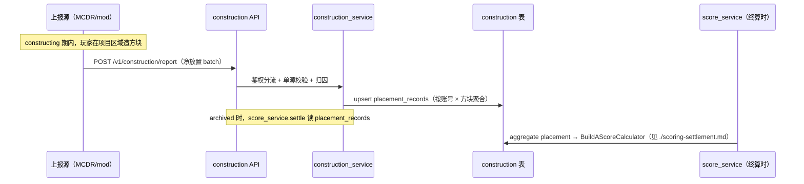
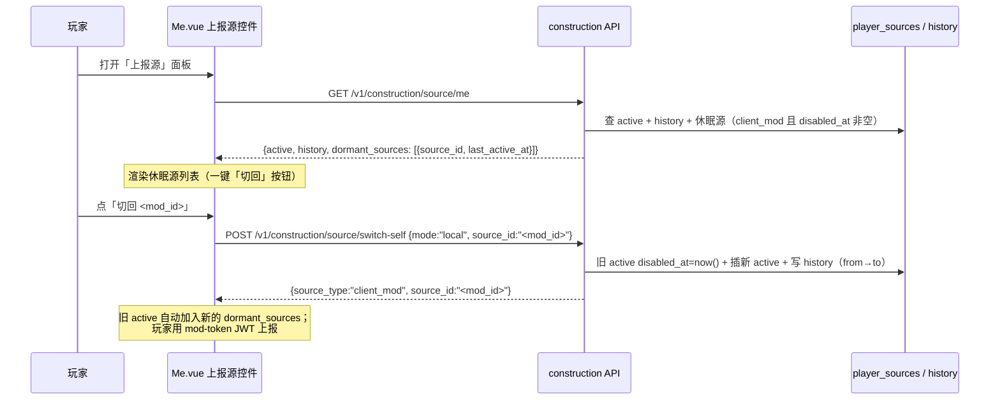
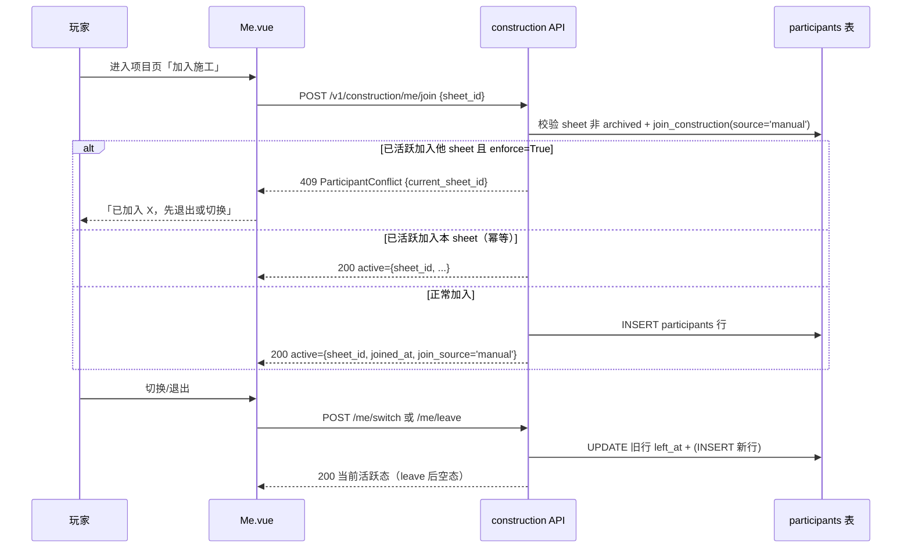

# 施工进度统计 · 端到端流程指南（设计契约）

> 本文件是施工进度统计层的**设计契约**：施工贡献怎么上报、怎么归因、怎么喂给积分层。
> **后端 + 前端 + 测试脚本已实现（迁移 0017，2026-07-27）**；MCDR 默认方块追踪器（§5）待 S-1 单独 PR。
> 端点参考见 [`../api/construction.md`](../api/construction.md)（含「默认追踪器实现契约」C-1~C-10）。
> 顶层索引见 [`../../architecture.md`](../../architecture.md) §7；红线见根 [`../../../CLAUDE.md`](../../../CLAUDE.md) §3（尤其 R-7 MCDR 纯客户端 / R-12 @new_thread）。

**读者**：要实现施工上报 / 写服务端 mod 上报源 / 接入玩家客户端 mod 的二次开发者。

**状态**：✅ 后端 + 前端已实现；🚧 MCDR 默认方块追踪器（§5）待 S-1 联网核实（见 §9）后单独 PR，实现时照 [`../api/construction.md`](../api/construction.md) §5 契约。

---

## 1. 一句话定位 + 设计取舍

`constructing` 期内，记录各玩家在项目区域的**方块净变化量**（放置 − 破坏），作为 A 类（建造）施工贡献，在项目归档时喂给 [积分层](./scoring-settlement.md) 的 `BuildAScoreCalculator`。

**核心取舍**（用户拍板）：
- **可插拔上报**：后端开放上报端点，官方默认实现 = MCDR 监听方块事件累计净放置；第三方/服主可写自己的上报源（服务端 mod / 玩家客户端 mod）
- **单项目启发式归因**：同一服务器同时进行两个大型项目概率较低 → 默认把 constructing 期内的方块变化归到当前唯一活跃项目；多项目并发时 fallback 走投影区域 box 裁剪（后续实现）
- **轻量防刷**：净放置（placed − broken）+ 每玩家单源 + 轻度告警（积分纯荣誉，不重度防）

> 与材料收集（sheets 协作，认领/上交）不同：施工统计是**被动观测**（玩家正常造，系统统计），不需要玩家显式操作。

---

## 2. 目标流程



**两个查询端点**：
- `GET /v1/construction/active-sheets`：MCDR 上报源查「当前该把数据归到哪个 sheet」（启发式归因用）
- `GET /v1/construction/{sheet_id}/progress`：查某项目当前施工进度（Web/MCDR 展示）

---

## 3. 鉴权矩阵（信任边界 = 是否在 MC 服务端）

| 上报源 | 鉴权 | payload | 约束 |
|---|---|---|---|
| **MCDR（官方默认）** | `X-Service-Token` | 多玩家聚合 batch | 信任边界内，代多个玩家上报 |
| **服务端 mod**（第三方）| `X-Service-Token`（约定路径读 token）| 多玩家聚合 batch | 服主 opt-in 白名单（Web 面板审）|
| **玩家客户端 mod** | 玩家 JWT（`Authorization: Bearer`）| **仅自己**（`player_uuid = JWT.active_uuid`）| 服主 opt-in + 玩家 `!!PCH` 开关 |
| **外部第三方** | ❌ **砍掉** | — | YAGNI |

**铁律**（同 [积分层](./scoring-settlement.md) §3）：
- service-token 绝不发第三方（R-11）；服务端 mod 复用 service-token（约定路径 `config/pch_system/sdk.properties` 读取，零配置）
- 玩家客户端 mod 走 JWT，**强制 `player_uuid = JWT.active_uuid`**——不能代他人上报
- 外部 API Key 通道整体砍除

### 3.1 每玩家单源策略

一个玩家同时**只接受一个活跃上报源**（防多源重复计数）：
- **自动切换**：新源首次带 JWT 上报即切，旧源置 `disabled`（可恢复，非黑名单）
- **手动切换**：`!!PCH construction switch <source>`（玩家自主）
- **审计**：切换历史落 `player_source_history`（谁/何时/从哪源切到哪源）

---

## 4. 核心抽象：上报端点契约

单端点 `POST /v1/construction/report`，**按鉴权头分流**（与积分层不同：积分层按角色分端点，本层同端点按头区分）：

```python
# 伪契约（实现时定 Pydantic schema）
class PlacementReport(BaseModel):
    sheet_id: int | None       # 上报源已知则填；None → service 启发式归因
    placements: list[PlacementEntry]

class PlacementEntry(BaseModel):
    player_uuid: UUID          # service-token 通道可代报；JWT 通道强制 = active_uuid
    registry_id: str           # 方块 registry id（namespace:path）
    placed_qty: int            # 该批次放置数
    broken_qty: int            # 该批次破坏数
    # net = placed - broken（防刷：破坏扣回）
```

**service 分流逻辑**：
- 头含 `X-Service-Token` → 校验 token → 多玩家 payload 信任
- 头含 `Authorization: Bearer` → 解 JWT → **强制覆盖** `entry.player_uuid = jwt.active_uuid`（忽略 payload 里的 uuid）
- 两者皆无 / 皆有 → 401（H-2 不静默降级，同 RS-8）

---

## 5. 官方默认实现：MCDR 方块变化量

> **前提（S-1 待核实）**：MCDR 提供方块放置/破坏事件钩子 + ServerInterface。本节是**设计假设**，实现前必查 <https://docs.mcdreforged.com/zh-cn/latest/>。事件名 / 回调签名 / ServerInterface 方法在本文中**未确定**，§9 是核实清单。

设计骨架（**非确定 API 签名，待 S-1 核实后填**）：

```python
# 伪代码 —— 事件名 / 回调签名 / ctx 字段均待 S-1 核实
@on_event(???_block_place)        # 待核实：MCDR 事件名
@new_thread("pch_construction")   # R-12：阻塞/耗时回调放新线程
def on_place(ctx):                # 待核实：ctx 字段（player / pos / block）
    record(player=ctx.player, registry=ctx.block, delta=+1)

@on_event(???_block_break)
@new_thread("pch_construction")
def on_break(ctx):
    record(player=ctx.player, registry=ctx.block, delta=-1)
```

**累计策略**：
- 维护内存 batch（玩家 × registry → 净量），定时（如 30s）或定量 flush 到 `/v1/construction/report`
- constructing 期外的事件不记（启动时 `GET active-sheets` 决定是否启用监听）
- **R-12 必守**：事件回调若跑在主线程，HTTP 上报必含超时 + 重试 + 失败回执，不阻塞 tick（同 sheets 通知轮询范式）

**单项目启发式归因**：`GET active-sheets` 返回当前 constructing 态 sheet（多个时按「最近活跃」或返回 None 让上报源自带 sheet_id）；默认假设同服同时一个大项目。

---

## 6. UI 分配（开关与审批分层）

| 功能 | 入口 | 理由 |
|---|---|---|
| **服务端 mod 白名单审批** | Web 管理面板（不进 `!!PCH`）| 服主权，玩家不该管 |
| **`official_tracker_enabled` 开关** | Web 管理面板 | 服主决定是否启用 MCDR 默认上报 |
| **`allow_server_mods` 开关** | Web 管理面板 | 服主决定是否接受第三方服务端 mod |
| **`allow_client_mods` 总开关** | Web 管理面板（默认 true）+ 玩家 `!!PCH` | 服主开总开关，玩家自主决定是否用客户端 mod |
| **`enforce_single_construction` 开关**（迭代 4） | Web 管理面板（默认 true） | 服主决定是否强制同账号同时仅 1 个活跃项目（默认 tracker + Web/MCDR join 流程） |
| **玩家客户端 mod 管理** | `!!PCH construction sources list` / `!!PCH mod-token` / `!!PCH mod-token revoke` | 玩家自主权 |
| **玩家切源** | `!!PCH construction switch <source>` | 见 §3.1 单源策略 |
| **休眠源一键切回**（迭代 2） | Web `Me.vue`「上报源」控件 | 见 §6.1 |
| **进度图表化**（迭代 2） | Web `ConstructionProgress.vue`（折线/柱/饼） | 见 §6.2 |
| **加入施工**（迭代 4） | Web `Me.vue`「当前施工项目」卡片 + MCDR `!!PCH construction join/switch/leave` | 见 §6.3 |
| **个人上报事件流水**（迭代 5） | Web `Me.vue`「我的上报历史」（accepted + 所有 skip reason） | 见 §6.3 |

**开关默认值**：`allow_client_mods = true` / `official_tracker_enabled = true` / `allow_server_mods = true` / `enforce_single_construction = true`（宽松默认，纯荣誉 + 白名单服，刷分影响可控）。

### 6.1 休眠源切换流程（迭代 2）

「休眠源」= 玩家此前用过的 `client_mod` 源、当前 `disabled_at` 非空（详见 [`api/construction.md`](../api/construction.md) §6 `dormant_sources`）。
**严格单源不变**——休眠源不参与 `/report` 单源校验，仅作历史展示 + 快速切回入口。



实现要点：
- 切回流程等价于显式 `switch-self`（无特例），仍需玩家之后用 mod-token JWT 上报——服务端不存 JWT、不代铸。
- 休眠源列表的去重 + 取最近激活时间，在 `construction_repo.list_dormant_sources(player_uuid)` 单次查询完成（避免 N+1）。
- 前端展示上限：列表默认展示前 5 个（按 `last_active_at` 倒序），其余折叠。

### 6.2 进度图表化 + 具名 slot（迭代 2）

`ConstructionProgress.vue`（项目详情「施工进度」tab）从「纯文本表格」升级为图表化展示，对应 `GET /{sheet_id}/progress` 的三个聚合字段（[`api/construction.md`](../api/construction.md) §4）：

| 图表 | 数据源 | 用途 | 库 |
|---|---|---|---|
| **折线图（时序趋势）** | `timeline`（时序快照，limit 200） | X 轴 `recorded_at`、Y 轴 `total_net`，每账号一条线 → 看施工进度趋势、谁在何时贡献了多少 | ECharts `LineSeries` |
| **柱状图（材料完成度）** | `material_completion` | X 轴 `item_name`、Y 轴 `net_qty` + 目标线 `need_qty` → 一眼看出哪些材料还缺 | ECharts `BarSeries` + `markLine` |
| **饼图（账号占比）** | `account_totals` | 按账号 `net_qty` 占比 → 谁造得最多（对齐归档 `contributions.png` 风格） | ECharts `PieSeries` |

**降级**：timeline 缺数据（snapshot 写失败、迁移 0018 前的历史项目）→ 折线图退化为单点（仅显示当前 `account_totals.net_qty`），不阻断整页渲染。

**具名 slot `name="charts"` 自定义扩展点**：

```vue
<template>
  <!-- 默认渲染：折线 + 柱 + 饼三件套 -->
  <slot name="charts" :timeline="timeline" :completion="material_completion" :totals="account_totals">
    <LineChart v-if="timeline.length" :data="timeline" />
    <BarChart :data="material_completion" />
    <PieChart :data="account_totals" />
  </slot>

  <!-- 明细表格始终渲染（不可覆盖） -->
  <ProgressTable :breakdown="breakdown" />
</template>
```

二次开发者可在自己的 `SheetEditor.vue` 注入自定义图表组件（如服主想加「按区块热力图」），不修改 `ConstructionProgress.vue` 源码：

```vue
<ConstructionProgress :sheet-id="sheetId">
  <template #charts="{ timeline, completion, totals }">
    <MyCustomHeatmap :data="timeline" />
  </template>
</ConstructionProgress>
```

设计契约：默认 slot 内容是「公开 API」——具名 `charts` 的 prop 集合（`timeline`/`completion`/`totals`）跨版本稳定（与 `GET /{sheet_id}/progress` 响应字段对齐），修改需发版说明。

### 6.3 加入施工 + 个人事件流水（迭代 4-5）

**加入施工**是玩家的显式「认领施工任务」动作：每个 Web 账号同时最多活跃加入 1 个施工项目（`enforce_single_construction=True` 默认；DB `uq_participants_active` partial unique index 兜底）。供默认 MCDR 追踪器按玩家路由上报 + Web 端展示「我当前在造哪个项目」。

**加入路径**（[`api/construction.md`](../api/construction.md) §4.2 端点表）：

| 触发场景 | 入口 | `join_source` | 冲突处理 |
|---|---|---|---|
| 备货(`collecting`) / 施工(`constructing`)阶段认领 lock 行 / progress 上交 | 后端 [`sheet_repo._maybe_auto_join`](../../../Backend/app/repositories/sheet_repo.py) 自动触发 | `auto` | 已在他项目 → silent skip；失败 swallow 不阻断上交 |
| 玩家显式「加入此项目」 | Web `Me.vue` / MCDR `!!PCH construction join` → `POST /me/join` | `manual` | `enforce=True` 且已在他项目 → 409 `ParticipantConflict`（含 `current_sheet_id`） |
| 玩家显式「切换到此项目」 | `POST /me/switch` | `manual` | 自动切换（leave 旧 + join 新同事务；并发冲突 → 409 原子回滚） |



**退出路径**（`left_reason`）：
- `manual_leave`：玩家 `/me/leave` 主动退出
- `switched`：`/me/switch` 切换（或 enforce=False 时 auto-join 自动切换）的旧行
- `archived`：归档经 [`close_all_participants`](../../../Backend/app/repositories/construction_repo.py) 批量退出（与 `advance_sheet` 同事务；保留历史行不 DELETE）

> **`POST /report` 不消费 `participants`**：第三方/玩家客户端 mod 源上报时跳过 join 直接落 `placement_records`，可同时多项目上报（§3.3 按材料封顶仍生效）。`participants` 仅约束默认 MCDR 追踪器 + Web/MCDR 显式 join 流程——默认 tracker 启动时调 `POST /active-by-uuids` 按玩家批量解析活跃 sheet_id（无 record → skip 该玩家）。

**个人上报事件流水**（迭代 5，[`api/construction.md`](../api/construction.md) §4.3）：玩家在 `Me.vue`「我的上报历史」看 `GET /me/report-events` 投影——每次 report 的 `PlacementOutcome` 逐条落 `report_events`（仅 bound 玩家：`account_id` 是查询锚），含 `accepted` + **所有 `skipped` reason**（`方块不在项目材料清单内` / `已达材料上限` / `玩家当前由其他源上报` / `客户端模组上报已被服主关闭` / `玩家当前无活跃上报源` / `无法归因` 等）。

设计动机：玩家此前只能看 `placement_snapshots`（`GET /me/reports`，累计净放置折线），看不到「为什么我的上报被拒」。事件流水让被拒原因可见，降低玩家调试成本（如发现自己的客户端 mod 被服主关闭、或本批次满额被部分拒收）。

---

## 7. 数据模型（R-1 全 DB）

`construction` schema（迁移 0017 基表 + 0018 时序快照 + 0021 加入施工 + 0023 事件流水，0020 加 sheets.constructing_at）：

| 表 | 用途 | 关键约束 |
|---|---|---|
| `player_sources` | 每玩家当前活跃上报源 | `(player_uuid)` 唯一（单源）；列 `source_id` / `source_type`（mcdr/server_mod/client_mod）/ `disabled_at` |
| `player_source_history` | 切换审计 | append-only；`(player_uuid, switched_at)` |
| `server_mod_sources` | 服务端 mod 白名单 | 服主审批后的 mod 标识 + 授权 token；迭代 3 加 `enabled` 逐源启停 |
| `placement_records` | 上报记录（终算聚合源）| `(sheet_id, account_id, registry_id)` 聚合；列 `net_qty`（placed − broken）|
| `placement_snapshots`（迭代 2） | 时序快照（折线图源）| 每次 report 后为本轮 accepted account 各写一条；append-only；展示用非权威 |
| **`participants`**（迭代 4） | **玩家加入施工项目记录** | **同账号同时最多 1 个活跃项目（`uq_participants_active` partial unique index 兜底）**；append-only（仅 UPDATE `left_at`/`left_reason`，从不 DELETE）；列 `web_account_id`/`sheet_id`/`joined_at`/`left_at`/`join_source('auto'\|'manual')`/`left_reason('manual_leave'\|'switched'\|'archived'\|'auto_displaced')` |
| **`report_events`**（迭代 5） | **玩家可见事件流水（`/me/report-events` 源）** | **append-only（无 UPDATE/DELETE）**；每次 report 的 `PlacementOutcome` 逐条落一行（accepted + 所有 skipped reason）；列 `sheet_id`(nullable) / `account_id`(NOT NULL) / `player_uuid` / `registry_id` / `action` / `reason` / `net_delta` |
| **`sheets.sheets.constructing_at`**（迭代 4，迁移 0020） | **施工开始时间戳** | nullable；进图表 xAxis 左沿 + 归档 timeline 点亮「进入施工」段 |

`sheets.sheet_rows`：方块清单 + 需求量（按 `registry_id` 聚合 `need_qty` = 上限，迭代 4 按材料封顶依据）。

`system.settings`（key-value JSONB，运行时开关，6 项）：
- `construction.allow_client_mods` / `official_tracker_enabled` / `allow_server_mods` / **`enforce_single_construction`（迭代 4 新增第 6 项，默认 true）**
- `construction.report_interval_seconds`（flush 频率）/ `anti_cheat_threshold`（轻度告警阈值）

config（`.env`）仅留连接串 / 密钥（R-11）/ 启动默认。

> 详细 DDL + 索引 + 不变量见 [`api/construction.md`](../api/construction.md) §11。

> `placement_records` 同时是 [积分层](./scoring-settlement.md) `BuildAScoreCalculator` 的数据源——跨 schema 只读聚合（R-1 不变：都在 PostgreSQL，后端独占）。

---

## 8. 二次开发指南

### 8.1 写一个上报源（服务端 mod）

1. 读 `config/pch_system/sdk.properties`（`PCH_API_URL` + `PCH_SERVICE_TOKEN`），零配置接入
2. 服主在 Web 面板把你的 mod 加白名单（`server_mod_sources`）
3. 实现方块事件 → 净量 batch → `POST /v1/construction/report`（带 `X-Service-Token`，多玩家 payload）
4. HTTP 必含超时 + 重试 + 失败本地缓冲（R-12 精神：别阻塞游戏 tick）

### 8.2 写一个玩家客户端 mod

1. 玩家游戏内 `!!PCH mod-token` 出码 → Web 兑换 JWT（复用 `!!PCH bind` 双向短码范式）
2. mod 带 `Authorization: Bearer <jwt>` 调 `/v1/construction/report`，payload 只填自己（server 强制 `active_uuid`）
3. 服主 `allow_client_mods=true` + 玩家自己开启；单源约束：开了你的 mod，官方 MCDR 源自动 disabled

### 8.3 换归因算法

默认单项目启发式（§5）。换精确区域扫描：上报源带 `sheet_id`（自带归因）+ 投影区域 box 裁剪（判断方块是否在项目投影内）。归因是 service 层策略，可后续抽 `AttributionStrategy` Protocol（YAGNI：先跑通启发式再抽象）。

---

## 9. S-1 待核实清单（实现前必查）

> 根 [`CLAUDE.md`](../../../CLAUDE.md) S-1：MCDR API 实现前必须联网核实。以下为本文档假设，**实现第一个动作就是逐条核实** <https://docs.mcdreforged.com/zh-cn/latest/>。

| # | 待核实 | 影响 |
|---|---|---|
| S1-1 | 方块**放置**事件名与回调签名（`on_block_place`? / `on_player_block_placement`?）| §5 默认实现可行性 |
| S1-2 | 方块**破坏**事件名与回调签名 | §5 同上 |
| S1-3 | 回调 ctx 字段（玩家 / 坐标 / 方块 registry id / BlockState）| 上报 payload 字段 |
| S1-4 | ServerInterface 拦截/查询方块能力（是否需查区块 NBT）| 归因算法 |
| S1-5 | 事件回调线程模型（是否跑主线程 → R-12 @new_thread 必要性）| §5 R-12 合规 |
| S1-6 | 离线模式 UUID 推导在事件 ctx 里的一致性（与 sheets UUID 推导对齐）| 单源校验 key |

> 若 S-1 核实发现 MCDR 无合适事件钩子，本层默认实现需改方案（如轮询 / 区域快照 diff），届时本文档 §5 重写。

---

## 10. 红线速查

| 红线 | 在施工层的体现 |
|---|---|
| **R-7** MCDR 纯客户端 | 默认实现只观测 + 上报，不做积分计算 / 不持久化业务数据 |
| **R-12** @new_thread | 事件回调若阻塞必放新线程；HTTP 上报含超时+重试+失败回执 |
| **R-5** account 归属 | placement_records 按 account_id 聚合（player_uuid → account 解析）；`participants`/`report_events` 同锚 `web_account_id`/`account_id` |
| **R-1** 业务库权威 | 所有 placement 落 PostgreSQL；MCDR 内存 batch 是临时缓冲 |
| **R-11** 密钥 | service-token 约定路径读，不发玩家；玩家 mod 走 JWT |
| **每玩家单源** | 同时只接受一个活跃上报源（防多源重复计数）|
| **单账号单活跃项目**（迭代 4） | 同账号同时最多 1 个活跃 `participants` 行（partial unique index 兜底）；仅约束默认 tracker + Web/MCDR join 流程，`POST /report` 零 project 校验不变 |
| **按材料封顶**（迭代 4） | 跨账号合计 `sum(net_qty)` 不得超过 `sum(need_qty)`，超量由后端 `submit_report` 逐条裁剪（不依赖追踪器侧） |

---

## 11. 待确认

- 方块过滤规则（空气/水/装饰方块是否计施工贡献？）
- 防刷阈值（单玩家单位时间净放置上限，超过仅告警不拒）
- 多项目并发的归因 fallback（投影 box 裁剪是否首版必须？）
- `report_interval_seconds` 默认值（实时性 vs 后端负载）

---

*创建：2026-07-25（v0.9 文档重构）。本层 🚧 规划中，本文为设计契约基线；§5 默认实现依赖 S-1 核实，§9 是核实清单。数据流向 [积分层](./scoring-settlement.md)，constructing 状态来自 [sheets API](../api/sheets.md) §5.2。

迭代 2 增量（2026-07-27）：§6.1 休眠源切换流程（local 模式选休眠源 → switch-self 唤醒）+ §6.2 进度图表化（折线时序 + 柱图材料完成度 + 饼图账号占比）+ 具名 slot `name="charts"` 自定义扩展点。*

迭代 4-5 增量（2026-07-28）：§6 UI 分配表加 `enforce_single_construction` 第 6 开关 + 加入施工入口 + 个人事件流水入口 + §6.3 加入施工流程（manual join/switch/leave + auto-join + close_all_participants；`POST /report` 零 project 校验不变）+ 个人上报事件流水设计动机 + §7 数据模型补三张新表/字段（`participants` / `report_events` / `sheets.constructing_at`）+ 第 6 运行时开关 + §10 红线速查补「单账号单活跃项目」「按材料封顶」。详见 [`api/construction.md`](../api/construction.md) §3.3 / §4.2 / §4.3 / §11。*
