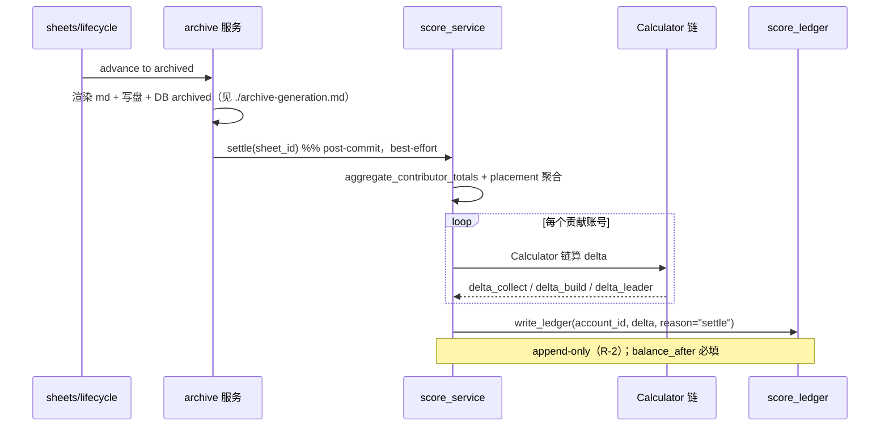

<!-- omit in toc -->
# 积分结算 · 端到端流程指南（设计契约）

> 本文件是积分结算层的**设计契约**：积分怎么算、怎么记、谁来调。本层 🟡 部分实现（低层 credit/debit/ledger REST 端点已落地，迁移 0024；settle 编排未实现），本文是剩余部分的对照基线。
> 顶层索引见 [`../../architecture.md`](../../architecture.md) §7；公式依据见 [`../../guide.md`](../../guide.md) 黄皮子积分体系；红线见根 [`../../../CLAUDE.md`](../../../CLAUDE.md) §3。

**读者**：要实现积分引擎 / 注入自定义公式 / 生成多平台客户端的二次开发者。

**状态**：🟡 部分实现。REST 低层端点（credit/debit/ledger，迁移 0024）已落地——契约见 [`../api/scoring.md`](../api/scoring.md)；settle 编排（Calculator 链 + 归档 hook）未实现。旧规划 [`../services/scoring-service.md`](../services/scoring-service.md)（即时记账 + per-UUID）已归档，**关键决策在此推翻**（见 §1.1）。

---

- [1. 一句话定位 + 关键决策翻转](#1-%E4%B8%80%E5%8F%A5%E8%AF%9D%E5%AE%9A%E4%BD%8D--%E5%85%B3%E9%94%AE%E5%86%B3%E7%AD%96%E7%BF%BB%E8%BD%AC)
  - [1.1 旧规划 → 现设计（必读）](#11-%E6%97%A7%E8%A7%84%E5%88%92-%E2%86%92-%E7%8E%B0%E8%AE%BE%E8%AE%A1%E5%BF%85%E8%AF%BB)
- [2. 目标流程（终算制）](#2-%E7%9B%AE%E6%A0%87%E6%B5%81%E7%A8%8B%E7%BB%88%E7%AE%97%E5%88%B6)
- [3. 鉴权矩阵（信任边界 = 是否在 MC 服务端）](#3-%E9%89%B4%E6%9D%83%E7%9F%A9%E9%98%B5%E4%BF%A1%E4%BB%BB%E8%BE%B9%E7%95%8C--%E6%98%AF%E5%90%A6%E5%9C%A8-mc-%E6%9C%8D%E5%8A%A1%E7%AB%AF)
- [4. 核心抽象：ScoreCalculator Strategy Protocol](#4-%E6%A0%B8%E5%BF%83%E6%8A%BD%E8%B1%A1scorecalculator-strategy-protocol)
  - [4.1 三个内置 Calculator](#41-%E4%B8%89%E4%B8%AA%E5%86%85%E7%BD%AE-calculator)
  - [4.2 服主自定义公式（服主权，非 API 能力）](#42-%E6%9C%8D%E4%B8%BB%E8%87%AA%E5%AE%9A%E4%B9%89%E5%85%AC%E5%BC%8F%E6%9C%8D%E4%B8%BB%E6%9D%83%E9%9D%9E-api-%E8%83%BD%E5%8A%9B)
- [5. 统一记账入口：score\_service.write\_ledger](#5-%E7%BB%9F%E4%B8%80%E8%AE%B0%E8%B4%A6%E5%85%A5%E5%8F%A3scoreservicewriteledger)
  - [5.1 REST 低层端点（已落地）](#51-rest-%E4%BD%8E%E5%B1%82%E7%AB%AF%E7%82%B9%E5%B7%B2%E8%90%BD%E5%9C%B0)
- [6. 数据模型（R-1 全 DB）](#6-%E6%95%B0%E6%8D%AE%E6%A8%A1%E5%9E%8Br-1-%E5%85%A8-db)
- [7. 多平台客户端（OpenAPI 优先）](#7-%E5%A4%9A%E5%B9%B3%E5%8F%B0%E5%AE%A2%E6%88%B7%E7%AB%AFopenapi-%E4%BC%98%E5%85%88)
  - [7.1 spec 优先，不手写 SDK](#71-spec-%E4%BC%98%E5%85%88%E4%B8%8D%E6%89%8B%E5%86%99-sdk)
  - [7.2 as-is 顺带发 Java 客户端（不保证质量）](#72-as-is-%E9%A1%BA%E5%B8%A6%E5%8F%91-java-%E5%AE%A2%E6%88%B7%E7%AB%AF%E4%B8%8D%E4%BF%9D%E8%AF%81%E8%B4%A8%E9%87%8F)
  - [7.3 服务端 mod SDK（若生态需要）](#73-%E6%9C%8D%E5%8A%A1%E7%AB%AF-mod-sdk%E8%8B%A5%E7%94%9F%E6%80%81%E9%9C%80%E8%A6%81)
- [8. 二次开发指南](#8-%E4%BA%8C%E6%AC%A1%E5%BC%80%E5%8F%91%E6%8C%87%E5%8D%97)
  - [8.1 加一个 Calculator](#81-%E5%8A%A0%E4%B8%80%E4%B8%AA-calculator)
  - [8.2 改公式参数](#82-%E6%94%B9%E5%85%AC%E5%BC%8F%E5%8F%82%E6%95%B0)
  - [8.3 生成多平台客户端](#83-%E7%94%9F%E6%88%90%E5%A4%9A%E5%B9%B3%E5%8F%B0%E5%AE%A2%E6%88%B7%E7%AB%AF)
- [9. 红线速查](#9-%E7%BA%A2%E7%BA%BF%E9%80%9F%E6%9F%A5)
- [10. 待确认（实现前必拍）](#10-%E5%BE%85%E7%A1%AE%E8%AE%A4%E5%AE%9E%E7%8E%B0%E5%89%8D%E5%BF%85%E6%8B%8D)


## 1. 一句话定位 + 关键决策翻转

项目归档（`archived`）那一刻，后端按贡献占比一次性结算积分，append-only 写流水，按 `web_account_id` 归属（R-5）。**积分纯荣誉、白名单服**——刷分影响可控，防刷从轻。

### 1.1 旧规划 → 现设计（必读）

| 维度 | 旧规划（scoring-service.md）| 现设计（本文）| 理由 |
|---|---|---|---|
| 结算时机 | 提交即记分（`/submissions` 实时）| **终算制**（archived 一次性结算）| 避免并发占比错算 + 易幂等 + 与 sheets 协作零冲突 |
| 归属锚 | per-UUID | **per-account**（`web_account_id`，R-5）| 离线改名=换 UUID，account 才稳定 |
| 触发端点 | `/projects/{id}/settle` | `advance to archived` 内嵌结算 | sheets 生命周期已有归档入口，不另设 |
| 引擎形态 | 硬编码 SQL | **ScoreCalculator Strategy Protocol** | 公式可插拔，服主自定义 |
| 外部接入 | （隐含开放）| **砍掉** API Key / 第三方 | YAGNI，纯荣誉无外部集成需求 |

> §3.2 公式（`S_总×n_i/N` 等，见旧文档）**仍有效**，只是结算时机与归属变了。

---

## 2. 目标流程（终算制）



**终算制三性质**：
- **协作期不记分**：`collecting→constructing` 期间只更新 `delivered_qty`/`contributed_qty`（sheets 协作流），不写 ledger
- **archived 一次性结算**：归档成功后 `score_service.settle(sheet_id)` 聚合全部贡献 → 链式 Calculator → 批量 write_ledger
- **幂等**：`settle` 前查 `(account_id, sheet_id, reason='settle')` 是否已有流水；重复调用跳过（归档本身是终态只读，正常不会重算）

**best-effort 边界**：结算失败（Calculator 异常 / DB 错）**不阻塞归档**（归档已 commit，业务正确）；失败记日志 + 通知 owner/admin 手动 `resettle`。理由：归档是玩家可感知的终态，积分是异步 derived——宁可事后补算，不让归档回滚。

---

## 3. 鉴权矩阵（信任边界 = 是否在 MC 服务端）

| 调用方 | 鉴权 | 能调什么 |
|---|---|---|
| **服务端组件（REST 低层通道）**（MCDR / 服务端 mod / 服主脚本）| `X-Service-Token` | ✅ `POST /v1/scoring/credit` / `POST /v1/scoring/debit`（批量代任意玩家记账）/ `GET /v1/scoring/ledger`（特权：全局 + 任意玩家）——契约见 [`../api/scoring.md`](../api/scoring.md) |
| **Web 前端** | 玩家 JWT | ✅ 普通玩家 `GET /v1/scoring/ledger`（仅自己）/ admin·owner JWT `GET /v1/scoring/ledger`（特权）；🚧 `GET /me/scores` 汇总、admin 面板 `manual_adj`（仍规划）|
| **玩家客户端 mod** | （不直接调积分层）| 🚧 走应用层查 `/me/scores` |
| **外部第三方** | ❌ **砍掉** | 不开放（YAGNI）|

**铁律**：service-token 是全局共享密钥，**绝不发给第三方**（R-11）；普通玩家 JWT 只能查自己（`account_id = JWT.sub`）；外部 API Key 通道整体砍除。

> `manual_adj` 落地方式扩展（2026-08-15）：原规划「admin JWT 面板直调」，现经 service-token REST 通道写入——服主脚本出账、`operator_uuid` 记录管理员 UUID；JWT 面板通道仍规划中。`settle` / `write_ledger` 是内部入口（归档 hook / REST 端点统一调用），不直接暴露。

> 与施工层的鉴权分流（同端点按头区分）不同：积分层**端点按角色隔离**——写端点（credit/debit）纯 service-token，读端点（ledger）按凭证三档分流（见 [`../api/scoring.md`](../api/scoring.md) §5）。

---

## 4. 核心抽象：ScoreCalculator Strategy Protocol

同 `Notifier`（RS-9）/ `SectionRenderer`（RS-11）范式——「注册式 Strategy」是本项目统一风格。

```python
@runtime_checkable
class ScoreCalculator(Protocol):
    name: str                       # 计算器标识（如 "collect" / "build_a" / "leader_bonus"）
    def calculate(self, ctx: SettlementContext) -> list[LedgerEntry]: ...
    # 纯函数：从 ctx 取聚合数据，返回该计算器贡献的 ledger 条目（可多账号）
    # 不查库、不写库、不改入参（不可变）
```

`SettlementContext`（service 预算后注入，Calculator 不查库）：

```python
{
    "sheet_id": int, "total_score_pool": Decimal,   # S_总，立项配置
    "contributor_totals": [(account_id, display_name, collect_qty)],  # 收集（来自 aggregate_contributor_totals）
    "placement_totals": [(account_id, placement_net)],  # 施工（来自施工层，A 类），可为空
    "leader_account_id": int | None, "leader_k": Decimal,
}
```

### 4.1 三个内置 Calculator

| Calculator | 公式 | 数据源 |
|---|---|---|
| `CollectScoreCalculator` | `S_i = S_总 × n_i / N`（n_i = 账号 i 收集量）| `contributor_totals` |
| `BuildAScoreCalculator` | `G_i = α·(t_i/T) + β·(p_i/P)`（t=施工占比，p=材料占比）| `placement_totals` + `contributor_totals` |
| `LeaderBonusCalculator` | `S_负责人 = S_全体 × k`（全体 = collect+build_a 之和）| 上游 Calculator 结果汇总 |

**编排**：`settle` 依次跑 collect → build_a（两者独立）→ leader_bonus（依赖前两者汇总）。`order` 字段控序（同 markdown_render 的 SectionRenderer）。

### 4.2 服主自定义公式（服主权，非 API 能力）

第三方/服主想加自定义计算器（如「特殊贡献加成」）= **服主把 `*.py` 丢进 `plugins/scoring/`**，启动时扫描注册。这是**服主权**（在自己服务器部署），**不是对外 API 能力**——不开放给玩家或第三方远程注入。

加载契约：模块导出 `Calculator` 类或 `register(registry)` 函数（具体待实现定，参考 `plugins/scoring/README.md`）。

---

## 5. 统一记账入口：score_service.write_ledger

范式同 `notification_service.notify`（RS-9）——**唯一入口**（不 commit，调用方控制事务），禁止其他路径直接 INSERT `score_ledger`。REST credit/debit 端点（§5.1）逐条经它落库。

```python
async def write_ledger(
    session: AsyncSession, *,
    account_id: int, delta: Decimal, reason: LedgerReason,
    sheet_id: int | None = None, operator_uuid: UUID | None = None,
    idempotency_key: str | None = None, note: str | None = None,
    allow_overdraft: bool = False,
) -> ScoreLedgerEntry:
    # 落库条目（REST 响应 entry 即其投影）；同事务 INSERT（append-only，R-2，balance_after 必填可审计重建）
```

**入口内流程**（顺序固定；`balance_after` **入口内计算、禁止外部传**——锁内读最新余额，避免并发竞态）：

1. 方向守卫：`delta` 符号与 `reason` 方向一致（credit 端 reason 配 +、debit 端配 −）
2. `pg_advisory_xact_lock(hashtext('scoring.score_ledger'), account_id)`：串行化同账号并发记账
3. 幂等检查：`(account_id, idempotency_key)` 已存在且同 payload（delta/reason/sheet_id）→ 回放原条目；不一致 → 抛 `ScoreIdempotencyConflict`（REST 层转该条 skip `idempotency key conflict`）
4. `balance_after` = 最新 `balance_after` + `delta`（锁内算）
5. 透支判定：`allow_overdraft=False` 且 `balance_after < 0` → 抛 `InsufficientBalance`（REST 层转该条 skip `insufficient balance`）
6. INSERT

**reason 枚举**（入账 / 出账分流；越界 422 整批拒）：

| 方向 | reason | 触发方 |
|---|---|---|
| 入账（+）| `collect` / `build_a` / `leader_bonus` / `settle` | 🚧 settle 编排（Calculator 链）；✅ `POST /v1/scoring/credit` |
| 出账（−）| `manual_adj` | ✅ `POST /v1/scoring/debit`（`operator_uuid` 记录管理员）；🚧 JWT 面板通道 |
| 出账（−）| `season_reset` | 🚧 赛季重置任务；✅ `POST /v1/scoring/debit` |

**入口权限**：REST 写通道仅 service-token（端点结构上无 Authorization 处理，玩家 JWT 不开放，H-2）；内部调用（settle 编排、赛季任务）同走本入口。

### 5.1 REST 低层端点（已落地）

三端点：`POST /v1/scoring/credit`（批量加分）· `POST /v1/scoring/debit`（批量扣分 + `allow_overdraft` 透支开关）· `GET /v1/scoring/ledger`（多角色流水分页）。逐条独立、业务性失败 skip 不连坐、HTTP 恒 200。全量契约（鉴权矩阵 / 字段 / skip_reason / 错误码）见 [`../api/scoring.md`](../api/scoring.md)。

---

## 6. 数据模型（R-1 全 DB）

`scoring` schema（迁移 0024 起）：

| 表 | 用途 | 关键约束 |
|---|---|---|
| `score_ledger` ✅ 已落地（0024）| 积分流水 | 列 `id` / `account_id`（FK `users.web_accounts` **RESTRICT**，R-5 锚）/ `delta`（numeric(18,2)，CHECK `<>0`）/ `reason`（CHECK 6 枚举）/ `balance_after` / `sheet_id`（**弱引用无 FK**）/ `operator_uuid` / `idempotency_key` / `note` / `created_at`。**append-only**（R-2）：行级 UPDATE/DELETE 由触发器 `scoring.prevent_ledger_modify` 强制拒绝（项目首个触发器）；不拦 TRUNCATE（测试清库依赖，TRUNCATE 防护属运维权限后续）|
| `submissions` 🚧 规划 | 材料提交批次（终算聚合源之一）| `batch_token` 防重放；`(sheet_id, account_id, registry_id, batch_token)` 唯一 |
| `placement_records` 🚧 规划 | 施工净放置（终算聚合源之二，来自施工层）| 按账号聚合；与 `construction` schema 的同源（跨 schema 只读聚合） |

`score_ledger` 索引（4 个）：

| 索引 | 用途 |
|---|---|
| `(account_id, id DESC)` | 余额读取主索引（取最新 `balance_after`）|
| `reason` | 按原因过滤 |
| `sheet_id`（partial，`WHERE sheet_id IS NOT NULL`）| 按项目回查 |
| `(account_id, idempotency_key)`（partial unique，`WHERE idempotency_key IS NOT NULL`）| 幂等 |

`system.settings`（key-value JSONB，运行时开关）：
- `scoring.auto_settle_on_archive`（默认 true：归档自动触发结算）
- `scoring.leader_k` / `scoring.alpha` / `scoring.beta`（公式参数，Web 面板动态改、即时生效）
- `scoring.season_reset_cron`（赛季周期，待确认）

config 文件（`.env` / `config.py`）仅留连接串 / 密钥（R-11）/ 启动默认值（DB 无值时回退）。

---

## 7. 多平台客户端（OpenAPI 优先）

积分层是**最可能被多平台消费**的层（Java 服务端 mod / 其他语言工具查榜单）。

### 7.1 spec 优先，不手写 SDK

- FastAPI 自动生成 `/openapi.json`（OpenAPI 3.1），**spec 即权威契约**
- snapshot 测试防漂移：升级 `tests/test_openapi_freeze.py` 从「只查路径」到「完整 spec diff」——任何端点/字段变更必须显式更新 snapshot
- 多语言客户端用 [openapi-generator](https://openapi-generator.tech/) 从 spec 生成（Java/Go/...），项目不维护手写 SDK

### 7.2 as-is 顺带发 Java 客户端（不保证质量）

CI 用 openapi-generator 生成一份 Java 客户端，发 GitHub Releases，README 标注：**自动生成、不保证质量、无 SLA、建议自行从 `/openapi.json` 生成**。不阻塞、不重点维护——满足「提供 jdk 但不保证质量」的诉求。

### 7.3 服务端 mod SDK（若生态需要）

约定路径 `config/pch_system/sdk.properties`（`PCH_API_URL` + `PCH_SERVICE_TOKEN`），mod 启动读取，零配置接入。**仅服务端 mod**（信任边界内，复用 service-token）；玩家客户端 mod 不走这条（走 JWT，见 [施工层指南](./construction-progress.md)）。

---

## 8. 二次开发指南

### 8.1 加一个 Calculator

1. 实现 `ScoreCalculator` Protocol（`name` + `calculate(ctx) -> list[LedgerEntry]`，纯函数）
2. 内置的注册到 `score_service` 默认链；服主自定义放 `plugins/scoring/*.py`
3. 测试：`test_score_service.py` 注入 fake `SettlementContext`，断言返回的 `LedgerEntry` 列表（金额/归属/reason）
4. 注意 `balance_after`：Calculator 只返 `delta`，`balance_after` 由 `write_ledger` 入口统一算（避免多 Calculator 并发竞态）

### 8.2 改公式参数

- 玩法参数（`leader_k` / `α` / `β`）→ `system.settings` JSONB，Web 管理面板改，即时生效，**不改代码**
- 公式结构（如新增一类贡献）→ 加 Calculator（见 8.1）
- 立项级覆盖（某项目 S_总）→ `sheets` 表 `total_score_pool` 列（立项时配）

### 8.3 生成多平台客户端

```bash
openapi-generator-cli generate -i http://backend:8000/openapi.json -g java -o out/pch-java-sdk
```

CI 集成见 `.github/workflows/`（待实现）；snapshot 防漂移见 §7.1。

---

## 9. 红线速查

| 红线 | 在积分层的体现 |
|---|---|
| **R-2** append-only | `score_ledger` 禁 UPDATE/DELETE（DDL + 触发器）；`balance_after` 必填，可审计重建 |
| **R-5** account 归属 | ledger 锚 `account_id`（非 UUID）；离线改名/换 UUID 积分不丢 |
| **R-1** 业务库权威 | 积分全部在 PostgreSQL；榜单是 derived view，可从 ledger 重建 |
| **R-10** 单库事务 | `write_ledger` 在调用方同一 session（结算批次可跨多账号单事务）|
| **R-11** 密钥不外发 | service-token 不给第三方；外部 API Key 通道砍除 |

---

## 10. 待确认（实现前必拍）

- 公式参数具体数值：`leader_k`（k∈[0.05,0.5] 分档）/ `α`·`β`（α+β=1）/ `r`（称号指数）
- 赛季周期：自然月 / 自然季 / 固定时长？赛季重置是清零还是归档转历史？
- `auto_settle_on_archive` 默认 true 是否要支持「归档不结算、手动 settle」的运营流程？
- 占比公式 N 的口径：按实际总提交（防超量刷分 → 配 `score_cap`）还是总需求？

---

*创建：2026-07-25（v0.9 文档重构）；更新：2026-08-15（积分层首批落地回填：credit/debit/ledger REST 端点 + 迁移 0024 + write_ledger 签名修正与 §10 负积分策略拍板，端点契约见 [`../api/scoring.md`](../api/scoring.md)）。旧规划 [`../services/scoring-service.md`](../services/scoring-service.md) §3.2 公式仍有效，其余已推翻（见 §1.1）。施工层数据源见 [`./construction-progress.md`](./construction-progress.md)，归档触发见 [`./archive-generation.md`](./archive-generation.md)。*
