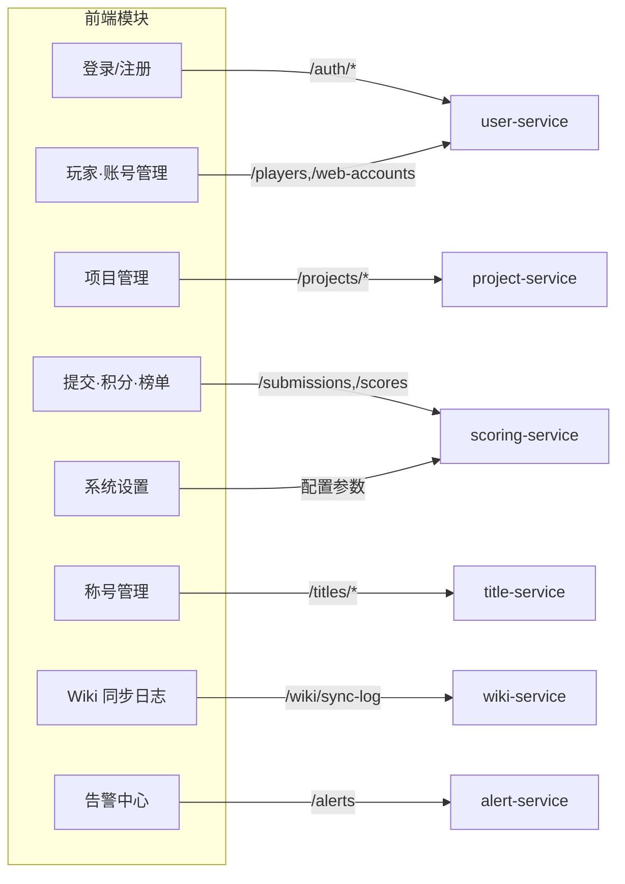
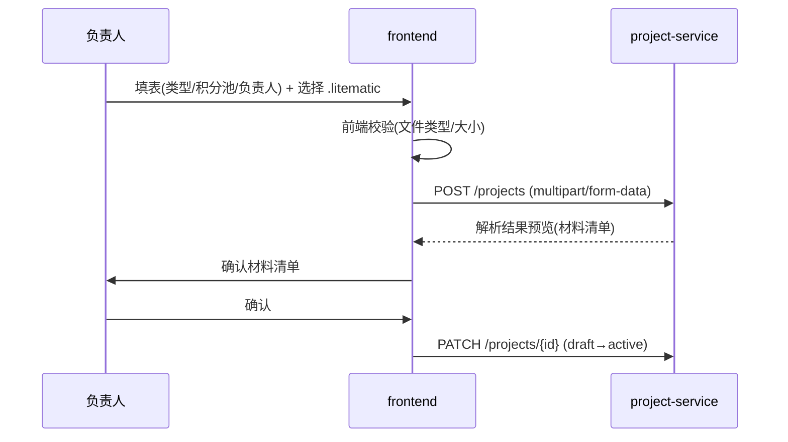

# 前端文档：Web 后台（Vue 3 + Element Plus）

> **统一总览**：[`../architecture.md`](../architecture.md) §5
> **对接后端**：所有 REST API 见 [`services/`](./services/) 各服务文档

## 1. 定位与技术栈

**定位**：管理员/负责人的 Web 后台，对应「三端架构」中的网页后台端。普通玩家主要在游戏内交互（MCDR），Web 端面向运营管理、项目立项、积分审计、告警处理。

| 维度 | 选型 | 理由 |
|---|---|---|
| 框架 | **Vue 3**（Composition API） | 生态成熟、上手快 |
| UI 库 | **Element Plus** | 中文后台组件齐全（表格/表单/上传/对话框） |
| 构建 | Vite | 快速 HMR |
| 状态 | Pinia | Vue3 官方推荐 |
| 路由 | Vue Router + 守卫 | JWT 鉴权拦截 |
| HTTP | Axios + 拦截器 | 统一注入 token / 错误处理 |
| 图表 | ECharts（可选） | 榜单/进度可视化 |
| i18n | vue-i18n（中文为主） | — |

## 2. 页面模块地图（与后端服务对应）



| 模块 | 关键页面 | 对接服务 |
|---|---|---|
| 登录/注册 | 登录、注册、绑定确认（`/bind/confirm`） | user-service |
| 玩家·账号 | 玩家列表、改名过户、白名单状态、Web 账号 | user-service |
| 项目管理 | 项目列表、立项（上传 `.litematic`）、材料清单、CSV 导出、状态流转 | project-service |
| 提交·积分·榜单 | 提交审计、手动修正、榜单（总/赛季/分类） | scoring-service |
| 称号管理 | 称号梯度配置、玩家已解锁称号、前缀预览 | title-service |
| Wiki 同步 | 同步日志、失败重试 | wiki-service |
| 告警中心 | 告警队列、ack/resolve、转白名单复核 | alert-service |
| 系统设置 | 积分参数（k/α/β/r）、Service Token 管理 | scoring/title-service |

## 3. 关键交互流程

### 3.1 立项（上传 .litematic）


- `.litematic` 用 `multipart/form-data` 上传，Element Plus `el-upload` 组件。
- 后端解析后回显材料清单，负责人确认才激活。

### 3.2 绑定确认（游戏内 !!bind 的 Web 侧闭环）

- 玩家游戏内 `!!bind` → 拿到短码 → Web 端「绑定确认」页输入短码 → `POST /bind/confirm`。

### 3.3 告警处理

- 告警中心列表（按 severity/status 过滤）→ 详情查看 evidence → ack/resolve / 转白名单复核。

## 4. 鉴权与路由守卫

```js
// router/index.js
router.beforeEach((to) => {
  const auth = useAuthStore()
  if (to.meta.requiresAuth && !auth.token) return '/login'
  if (to.meta.roles && !to.meta.roles.includes(auth.role)) return '/403'
})
```
```js
// axios 拦截器
instance.interceptors.request.use(cfg => {
  if (auth.token) cfg.headers.Authorization = `Bearer ${auth.token}`
  return cfg
})
instance.interceptors.response.use(r => r, err => {
  if (err.response?.status === 401) router.push('/login')
  return Promise.reject(err)
})
```
- JWT 存 Pinia + localStorage；401 自动跳登录。
- 路由 meta 标注 `roles`（user/admin/owner）做前端可见性控制（**真实权限以后端为准**）。

## 5. 构建与部署

- **开发**：`vite dev`（默认 :5173），代理 `/api` → `http://localhost:8000`（去 `/api` 前缀）。
- **生产**：`vite build` 产出 `Frontend/dist/` 纯静态文件，与后端同源避免 CORS（无 `VITE_*` 环境变量，同一份 dist 任意环境通用）。两条托管路径：
  - **容器内 web 服务（默认）**：compose `web` 服务（多阶段 `Frontend/Dockerfile`：node 构建 → nginx 托管）；`.env` 的 `COMPOSE_PROFILES=web` 激活、`WEB_PORT`（默认 5173，免 root + 对齐 `WEB_BASE_URL`）；nginx 反代 `/api/` → compose 服务名 `backend:8000`（配置权威源 `Frontend/nginx.conf`）。
  - **非容器**：宿主 nginx 托管 `Frontend/dist/` + 反代 `/api/` → `127.0.0.1:8000`（模板 `Deploy/Nginx/pchsystem.host.conf.example`）。
- history 路由模式需 nginx `try_files $uri $uri/ /index.html`；`proxy_pass` 末尾 `/` 必带以去 `/api` 前缀。
- `Frontend/` 变更时 `Scripts/update.sh` 自动重建 web 镜像（dist 烘焙进镜像，非 bind-mount）；web 禁用则走宿主 `npm run build`。
- 与 wiki.js（:3000）独立域名/端口，通过链接跳转。

## 6. 风险与待确认

| 项 | 说明 | 缓解 |
|---|---|---|
| 前端权限仅可见性 | 绕过前端直接调 API | **后端 RBAC 为准**，前端只控展示 |
| 大文件上传 | `.litematic` 较大 | 限制大小 + 分块/进度条 |
| 榜单实时性 | 高频刷新压力 | 轮询限频 / WebSocket（后续） |
| Token 存储 | localStorage 易 XSS | 配合 CSP + HttpOnly cookie（待确认） |
| 参数误改 | 系统设置改坏积分参数 | 改前确认 + 审计日志 + 灰度 |

> 待确认：前端是否首版就做玩家自助页（个人积分/称号），还是纯管理后台（玩家全走游戏内）。建议首版纯管理后台，玩家侧全走 MCDR `!!` 命令。
