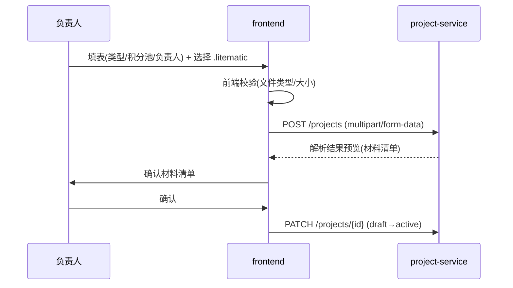
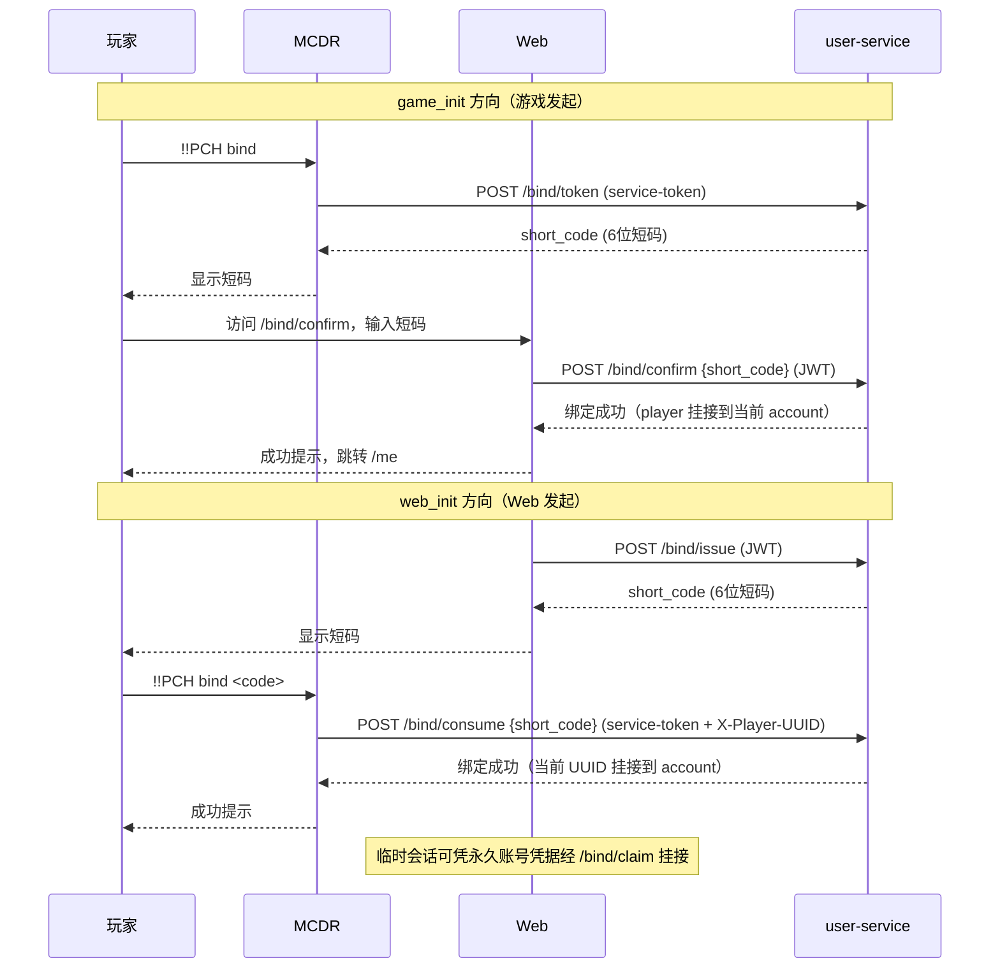

# 前端文档：Web 后台（Vue 3 + Element Plus）

> **统一总览**：[`../architecture.md`](../architecture.md) §5
> **对接后端**：所有 REST API 见 [`services/`](./services/) 各服务文档

## 1. 定位与技术栈

**定位**：管理员/负责人的 Web 后台，对应「三端架构」中的网页后台端。普通玩家主要在游戏内交互（MCDR），Web 端面向运营管理、项目立项、积分审计、告警处理。

| 维度 | 选型 | 理由 |
|---|---|---|
| 框架 | **Vue 3**（Composition API） | 生态成熟、上手快 |
| UI 库 | **Element Plus** | 中文后台组件齐全（表格/表单/上传/对话框） |
| 构建 | Vite | 快速 HMR |
| 状态 | Pinia | Vue3 官方推荐 |
| 路由 | Vue Router + 守卫 | JWT 鉴权拦截 |
| HTTP | Axios + 拦截器 | 统一注入 token / 错误处理 |
| 图表 | ECharts（可选） | 榜单/进度可视化 |
| i18n | vue-i18n（中文为主） | — |

## 2. 页面模块地图（与后端服务对应）

```mermaid
flowchart LR
    subgraph 前端模块
        AUTH[身份管理]
        USER[玩家·账号管理]
        PROJ[项目管理]
        SCORE[提交·积分·榜单]
        TITLE[称号管理]
        WIKI[Wiki 同步日志]
        ALERT[告警中心]
        SYS[系统设置]
    end
    AUTH -->|/auth/*,/web-accounts/*,/bind/*| U[user-service]
    USER -->|/players,/web-accounts| U
    PROJ -->|/sheets/*,/sheets/{id}/managers| P[project-service]
    SCORE -->|/submissions,/scores| S[scoring-service]
    TITLE -->|/titles/*| T[title-service]
    WIKI -->|/wiki/sync-log| W[wiki-service]
    ALERT -->|/alerts| A[alert-service]
    SYS -->|配置参数| S
```

| 模块 | 关键页面 | 对接服务 |
|---|---|---|
| 身份管理 | `Login.vue`（密码登录）/ `Register.vue`（临时→永久）/ `BindConfirm.vue`（game_init 短码确认）/ `ClaimBind.vue`（web_init 挂接）/ `Me.vue`（账号 + 绑定 UUID 列表 + 昵称）/ `AuthExchange.vue`（token 兑换 + 临时/永久分流） | user-service |
| 玩家·账号 | 玩家列表、改名过户、白名单状态、Web 账号 | user-service |
| 项目管理 | 项目列表、立项（上传 `.litematic`）、材料清单、CSV 导出、状态流转、协管员管理面板（`SheetEditor` 内联，owner 增/撤销 + 全员可见列表） | project-service |
| 提交·积分·榜单 | 提交审计、手动修正、榜单（总/赛季/分类） | scoring-service |
| 称号管理 | 称号梯度配置、玩家已解锁称号、前缀预览 | title-service |
| Wiki 同步 | 同步日志、失败重试 | wiki-service |
| 告警中心 | 告警队列、ack/resolve、转白名单复核 | alert-service |
| 系统设置 | 积分参数（k/α/β/r）、Service Token 管理 | scoring/title-service |

## 3. 关键交互流程

### 3.1 立项（上传 .litematic）


- `.litematic` 用 `multipart/form-data` 上传，Element Plus `el-upload` 组件。
- 后端解析后回显材料清单，负责人确认才激活。

### 3.2 绑定确认（双向流程）



**两种方向**：
- **game_init**：玩家游戏内 `!!PCH bind` 出短码 → Web `/bind/confirm` 输码确认
- **web_init**：Web `/bind/issue` 出短码 → 玩家游戏内 `!!PCH bind <code>` 消费 → Web `/bind/claim` 挂接（临时会话挂永久账号）

**关键端点**：
- `POST /bind/token`（service-token，game_init 出码）
- `POST /bind/confirm`（JWT，消费 game_init 码）
- `POST /bind/issue`（JWT，web_init 出码）
- `POST /bind/consume`（service-token + X-Player-UUID，消费 web_init 码）
- `POST /bind/claim`（临时会话 JWT，凭永久账号凭据挂接）

**临时账号引导**（`isTemporaryAccount` getter → `Me.vue` 横幅）：
- 横幅显示「当前是临时账号」+「注册永久账号」/「绑定已有账号」按钮
- `AuthExchange.vue` 按 `is_temporary` 分流到 `/register` 或 `/me`

### 3.3 协管员管理（三层 RBAC）

**权限层级**（`useSheetDetail` composable）：
- **Tier A（canManage）**：表 owner 或 superuser（admin/owner）——高危操作（改名/删表/归档/授予撤销协管员）
- **Tier B（canEdit）**：Tier A ∨ 协管员（isManager）——常规写操作（增删改行/子物品/进度/解除/打回/进入施工）
- **isManager 判定**：`managers.some(m => m.member_uuids.some(u => viewer_uuids.includes(u)))`（同账号任一 UUID 继承）

**关键概念**：
- **viewer_uuids**：后端按当前查看者的 account 解析返回，= 同 account 所有 UUID（`auth store 绑定 UUIDs + 当前 UUID`）
- **account 级**：manager 与 owner 锚定 `web_account_id`，同账号任一 UUID 继承权限（R-5 一致）

**协管员管理面板**（`SheetEditor` 内联）：
- **Owner 可见**：协管员列表 + 增/撤销按钮
- **全员可见**：协管员列表（display_name 展示）
- **授予流程**：玩家名联想（el-autocomplete 远程搜索）→ 选中后存 uuid → `POST /sheets/{id}/managers {player_uuid}`
- **撤销流程**：`DELETE /sheets/{id}/managers {web_account_id}`（self-revoke 需 `player.web_account_id is not null`）
- **权限矩阵**：详见 [`Docs/architecture/api/sheets.md`](./api/sheets.md) §7.1（M01-M26 全覆盖）

**阶段按钮分流**：
- **Tier A**：归档、改名、删表按钮（owner 专属）
- **Tier B**：进入施工按钮（owner + 协管员）

### 3.4 告警处理

- 告警中心列表（按 severity/status 过滤）→ 详情查看 evidence → ack/resolve / 转白名单复核。

## 4. 鉴权与路由守卫

```js
// router/index.ts
router.beforeEach((to) => {
  const auth = useAuthStore()
  if (!to.meta.public && !auth.isAuthenticated) return '/auth'
})
```
```js
// axios 拦截器（utils/http.ts）
instance.interceptors.request.use(cfg => {
  if (auth.accessToken) cfg.headers.Authorization = `Bearer ${auth.accessToken}`
  return cfg
})
instance.interceptors.response.use(r => r, err => {
  if (err.response?.status === 401) {
    auth.clear()
    router.push('/auth')
  }
  return Promise.reject(err)
})
```

**鉴权机制**：
- JWT 存 Pinia + localStorage（accessToken/refreshToken + player + account）
- 路由 `meta.public` 二分：公开路由（`/auth`、`/login`、`/register`）无需登录，其余需登录
- 401 由 axios 拦截器统一处理（`auth.clear()` + 跳 `/auth`）

**权限架构**（R-5 一致）：
- **前端权限仅可见性**（R-9）：真实权限以**后端 RBAC 为准**，前端只控展示
- **account 级权威源**：`auth.account.role`（未绑玩家回退 `auth.player.role`）
- **viewer_uuids**：同 account 所有 UUID（后端按当前查看者的 account 解析返回）
- **三层 RBAC**：`canManage`（tier A）/ `isManager` / `canEdit`（tier B = canManage ∨ isManager）

## 5. 构建与部署

- **开发**：`vite dev`（默认 :5173），代理 `/api` → `http://localhost:8000`（去 `/api` 前缀）。
- **生产**：`vite build` 产出 `Frontend/dist/` 纯静态文件，与后端同源避免 CORS（无 `VITE_*` 环境变量，同一份 dist 任意环境通用）。两条托管路径：
  - **容器内 web 服务（默认）**：compose `web` 服务（多阶段 `Frontend/Dockerfile`：node 构建 → nginx 托管）；`.env` 的 `COMPOSE_PROFILES=web` 激活、`WEB_PORT`（默认 5173，免 root + 对齐 `WEB_BASE_URL`）；nginx 反代 `/api/` → compose 服务名 `backend:8000`（配置权威源 `Frontend/nginx.conf`）。
  - **非容器**：宿主 nginx 托管 `Frontend/dist/` + 反代 `/api/` → `127.0.0.1:8000`（模板 `Deploy/Nginx/pchsystem.host.conf.example`）。
- history 路由模式需 nginx `try_files $uri $uri/ /index.html`；`proxy_pass` 末尾 `/` 必带以去 `/api` 前缀。
- `Frontend/` 变更时 `Scripts/update.sh` 自动重建 web 镜像（dist 烘焙进镜像，非 bind-mount）；web 禁用则走宿主 `npm run build`。
- 与 wiki.js（:3000）独立域名/端口，通过链接跳转。

## 6. 风险与待确认

| 项 | 说明 | 缓解 |
|---|---|---|
| 前端权限仅可见性 | 绕过前端直接调 API | **后端 RBAC 为准**，前端只控展示（R-9） |
| 大文件上传 | `.litematic` 较大 | 限制大小 + 分块/进度条 |
| 榜单实时性 | 高频刷新压力 | 轮询限频 / WebSocket（后续） |
| Token 存储 | localStorage 易 XSS | 配合 CSP + 输入转义缓解；后续若改 HttpOnly cookie 需重做鉴权链路（RS-4） |
| 参数误改 | 系统设置改坏积分参数 | 改前确认 + 审计日志 + 灰度 |

> **已落地**：玩家自助页（`Me.vue`：账号 + 绑定 UUID 列表 + 昵称编辑 + 绑定新身份）
>
> **待办**：`Identities.vue`（账号下多 UUID 列表 + active_uuid 切换 UI）尚未实现

---

**最后更新：2026-07-21（v0.7.0：身份管理模块 + 协管员管理面板 + account 级三层 RBAC）**
