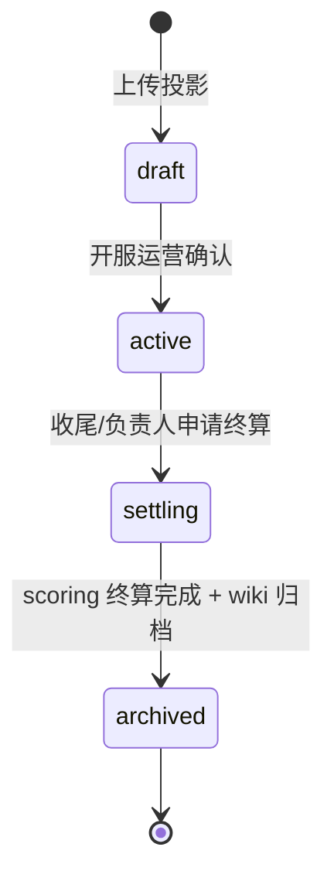

# 服务文档：project-service（项目与材料清单）

> **统一总览**：[`../../architecture.md`](../../architecture.md) §5
> **数据模型**：[`../data-model.md`](../data-model.md) §3（`projects` schema）

## 1. 职责边界

| 管 | 不管 |
|---|---|
| 项目生命周期与状态机 | 提交记账（交 scoring-service） |
| `.litematic` 解析 → 材料清单 | SNBT/箱子扫描（在 mcdr-plugin） |
| block→item 归一化 | 称号解锁（交 title-service） |
| 积分池配置（`S_总` / `score_cap`） | wiki 归档内容生成（交 wiki-service） |
| CSV 导出（投影→导出） | 玩家身份（交 user-service） |
| 项目完结触发终算 | |

**定位**：项目制玩法的「定义侧」。把一个 `.litematic` 投影转化成可贡献的材料清单 + 积分池，是整个结算链路的起点。

## 2. 对外接口（REST API）

| 方法 | 路径 | 调用方 | 说明 |
|---|---|---|---|
| POST | `/projects` | Web(admin/leader) | 上传 `.litematic` + 配置（类型/积分池/负责人） |
| GET | `/projects` | Web/MCDR | 项目列表（可按 status 过滤） |
| GET | `/projects/{id}` | Web/MCDR | 项目详情 + 进度概览 |
| PATCH | `/projects/{id}` | Web(admin) | 状态流转（draft→active→settling→archived） |
| GET | `/projects/{id}/materials` | Web/MCDR | 材料清单 + 已交付/需求量 |
| POST | `/projects/{id}/litematic` | Web(admin) | 重新上传/重新解析投影 |
| GET | `/projects/{id}/export.csv` | Web | 导出 CSV（`Item,Total,Missing,Available`） |

## 3. 内部实现要点

### 3.1 `.litematic` 解析（核心）—— 复用 litemapy

```python
from litemapy import Schematic

def parse_litematic(path: str) -> dict[str, int]:
    schem = Schematic.load(path)
    counts: dict[str, int] = {}
    for block in schem.iter_blocks():           # 遍历所有方块
        rid = block.block_id                    # registry id，如 'create:warehouse'
        if rid in SKIP_BLOCKS:                  # 见 §3.2 归一化
            continue
        counts[rid] = counts.get(rid, 0) + 1
    return counts
```
- **关键**：`block.block_id` 直接给 registry id（`namespace:path`），**根治 CSV 仅显示名不匹配的问题**。
- 证据：[`litemapy`](https://github.com/Spindust/litemapy)（v0.7.2b0，2026 仍维护）`Schematic.load` → `block` API。
- 解析结果落 `material_lists(item_id, required_qty)`，item_id 统一 registry id。

### 3.2 block→item 归一化（关键边界）

投影里存的是**方块**，提交的是**物品**，需归一化：

| 场景 | 处理 |
|---|---|
| 空气/水/岩浆/结构空位 | 过滤（`SKIP_BLOCKS` 黑名单） |
| 带 BlockState 的方块 | 剥离 properties，只留 `namespace:path`（如 `minecraft:stairs[waterlogged=true]` → `minecraft:oak_stairs`） |
| 双半板/床/门等多部件方块 | 合并计数（1 门 = 1 物品） |
| Create mod 自定义方块 | registry id 直接保留，依赖 litemapy 正确读取 |

- 黑名单 + 归一化映射表集中维护（配置文件），**不在多处硬编码**。
- 边界用例（潜影盒内含物等）首版不计入清单，仅计方块本身。

### 3.3 CSV 导出（投影→导出）

用户明确：「做一个抽象层，现在暂时仅仅支持投影到导出的 CSV」。导出格式对齐现有 `Material/material_list_*.csv`：

```python
def export_csv(project_id) -> str:
    rows = db.query("""
        SELECT item_id, required_qty, delivered_qty
        FROM projects.material_lists WHERE project_id = :pid
    """, pid=project_id)
    # 表头与现有 CSV 一致
    lines = ["Item,Total,Missing,Available"]
    for r in rows:
        missing = max(0, r.required_qty - r.delivered_qty)
        lines.append(f"{r.item_id},{r.required_qty},{missing},{r.delivered_qty}")
    return "\n".join(lines)
```
- **抽象层**：定义 `ProjectionExporter` 接口，首版仅 `CsvExporter` 实现，未来可扩展 `LitematicExporter` 等。

### 3.4 项目状态机


- `active` 才接受 `!!submit`；`settling` 冻结提交、触发 scoring-service 终算；`archived` 后只读。

### 3.5 积分池配置

立项时配置 `total_score_pool`（S_总）与可选 `score_cap`（单项目兜底），落 `projects` 表。具体公式在 scoring-service 执行，本服务只存配置。

## 4. 依赖的其他服务

- **user-service**：解析负责人 `leader_uuid` 身份与权限。
- **wiki-service**：立项时建项目 wiki 节点 + 授负责人编辑权；归档时写归档页。
- **scoring-service**：`settling→archived` 时触发终算（占比/加权/负责人 k 增发）。

## 5. 所属数据表

`projects` schema（见 [`data-model.md`](../data-model.md) §3）：
- `projects`（项目，含 `total_score_pool`、`leader_uuid`、`litematic_path`、`status`）
- `material_lists`（材料清单，`(project_id, item_id)` 唯一）

## 6. 风险与待确认

| 项 | 说明 | 缓解 |
|---|---|---|
| block→item 归一化边界 | 清单与提交对不上 | 黑名单 + 去 properties，集中在 §3.2 |
| Create mod registry id 命名 | mod 更新致 id 变 | 解析时记录 mod 版本；建立 id 变更映射 |
| 大投影解析性能 | 数十万方块遍历慢 | 流式遍历 + 后台任务 + 超时 |
| 双部件方块漏计 | 床/门计数偏差 | 归一化映射表 + 测试用例 |
| CSV 编码 | 现有 CSV 是 GB18030，含中文显示名 | 导出统一 UTF-8 + item_id（registry），显示名仅作展示列 |

> 待确认：导出 CSV 是否需附**中文显示名**列（需 registry id → 显示名映射表，Create mod 无官方中文名表，需自维护）。
