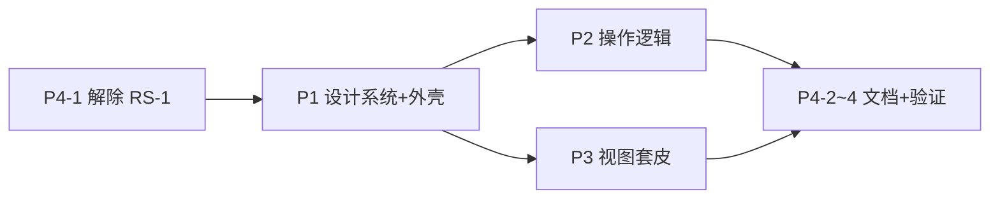

<!-- omit in toc -->
# 前端优化计划：视觉统一 + 操作逻辑重构

> **目标**：Web 后台与 wiki 统一「像素矿井」视觉语言，并补齐当前缺失的应用外壳与交互规范。
> **范围**：`Frontend/` 样式层 + 交互层。**不改** API 调用、store 数据流、RBAC 判定、轮询逻辑。
> **基准**：`PCHSystem-wiki/src/styles/custom.css` + `src/assets/logo{,-dark}.svg`
> **已拍板**：① 解除 RS-1 全量优化 ② 主题跟随系统 + 手动切换 ③ 顶栏 + 移动端抽屉

---

## 1. 现状审计（已核查代码）

| # | 问题 | 证据 |
|---|---|---|
| **A-1** | `src/style.css` 是**死文件** | `main.ts` 只 import `element-plus/dist/index.css`，从未引入 style.css |
| **A-2** | 该文件是 **Vite 模板残留** | `--accent:#aa3bff` 紫色、`.hero/#next-steps/#docs/#spacer` 选择器与项目无关 |
| **A-3** | `App.vue` 导航全**内联样式** | `style="…border-bottom:1px solid #eee"` 硬编码，暗色下瞎眼 |
| **A-4** | **无应用外壳** | 仅 4 个 `RouterLink` + 版本号；无 logo、无 active 态、无用户区、**无登出** |
| **A-5** | **无暗色模式** | 无 `data-theme` 机制，EP `dark/css-vars.css` 未引入 |
| **A-6** | 模板残留资产 | `assets/{hero.png,vue.svg,vite.svg}`；`index.html` 标题 `frontend`、`lang="en"` |
| **A-7** | 错误提取**重复实现** | `SheetList.vue::errorMessage()` 与 `utils/error.ts::extractApiError` 逻辑相同（违反 DRY） |
| **A-8** | 校验散在 handler | `Login.vue` 手写 `if(!REGEX.test) ElMessage.warning`，未用 `el-form` rules，无字段级红字 |
| **A-9** | 无空态 / 骨架屏 | 列表 `loading` ref 直挂；空列表无引导文案 |
| **A-10** | 路由无 404 / 无标题 | `router/index.ts` 无 catch-all、无 `afterEach` 设 `document.title` |

---

## 2. 设计令牌（从 wiki 提取）

```
绿 accent  暗 low #173322 / base #4ADE80 / high #B9F4CF
           亮 low #D5F3E0 / base #15803D / high #14532D
深板岩灰   暗 gray-1 #CBD5E1 … gray-7 #0E1626 · bg #0B1220 · hairline #1F2D44
           亮 gray-1 #1E293B … gray-7 #F8FAFC · bg #FBFCFE · hairline #E2E8F0
圆角  卡片 14px · 焦点环 4px        像素网格  26px
动效  链接 150ms / 卡片 180ms ease · hover translateY(-2px)
阴影  暗 0 10px 30px -14px rgba(74,222,128,.22) · 亮 rgba(21,128,61,.20)
焦点  outline 2px solid accent + offset 2px（a11y 地板，不可删）
```

**命名**：不照抄 wiki 的 `--sl-*`（Starlight 私有），改 `--pch-*`，再单向映射到 `--el-*`，避免与 EP 变量混淆。

---

## 3. 品牌资产（必须用 wiki logo）

两版 SVG 同构（`viewBox 0 0 210 40`，像素草方块 isometric + 字标），仅色值不同：

| 文件 | 草方块 | 泥土 | 字标 | 用途 |
|---|---|---|---|---|
| `logo.svg` | `#22C55E` | `#6B4C33` | `#0F172A` | 亮色背景 |
| `logo-dark.svg` | `#4ADE80` | `#7C5A3C` | `#F1F5F9` | 暗色背景 |

1. **复制**两文件 → `Frontend/src/assets/`（不用 symlink：前端需独立构建，wiki 仓不是前端依赖）。
2. **新增 `components/BrandLogo.vue`**：随主题切换两版（复用 P1-4 的 `useTheme`）；props `{ height?: number }`（顶栏 28px / 登录页 40px）；SVG 自带 `<title id="t">` 已满足 a11y，包裹层不再重复 `aria-label`。
3. **使用点**：顶栏左上（链接回 `/me`）· `Login`/`Register`/`AuthExchange` 页头 · 空态插画位。
4. **favicon**：取徽标部分（去字标，`viewBox 0 0 60 60`）导出 `public/favicon.svg`，替换现存 9.5KB 模板图标。
5. **`index.html`**：`lang="zh-CN"`、`<title>PCHSystem 后台</title>`、双模式 `<meta name="theme-color">`。

> 字标内嵌字体栈 `-apple-system…'PingFang SC'`，与前端 sans 栈一致，无需改 SVG 内部。

---

## 3.5 设计方向（视觉主张）

**主题定位**：Minecraft 建造项目的施工台账。受众是服内管理员/项目负责人/搬砖玩家 —— 他们每天读的是材料清单和数字，不是营销页。界面唯一职责：**一眼看清还差什么材料、谁认领了、进度到哪**。

**Color** — wiki 令牌为权威底座，另补两个功能色（EP 默认色板会与绿色系打架，不用）：

| 名 | 值 | 用途 | 来源 |
|---|---|---|---|
| `deepslate` | `#0B1220` | 底 | wiki |
| `slate-panel` | `#0E1626` | 面板 | wiki |
| `grass` | `#4ADE80` | accent · done | wiki（权威） |
| `dirt` | `#7C5A3C` | claimed / 施工中 | **取自 logo 泥土多边形**，非随机橙 |
| `redstone` | `#DC5B4A` | 打回 / 异常 | 系统内唯一暖色告警 |
| `bone` | `#F1F5F9` | 高对比文字 | logo 字标同色 |

**Type** — 不引 CJK webfont（自托管 + 体积 + 离线可用）。个性来自**处理方式**而非字体本身：
- 界面：`-apple-system, 'PingFang SC', 'Noto Sans SC'`
- 数据：`ui-monospace, 'SF Mono', 'JetBrains Mono', Consolas` —— registry id 与全部数量
- **关键**：所有数量列 `font-variant-numeric: tabular-nums`，位数纵向对齐；比例 1.2（密集台账，非营销页 1.5）；字重只用 400/500/700

**Layout** — 顶栏 + 移动端抽屉（已拍板）。

**Signature（唯一记忆点）· 库存记数排版**

`formatQty` 已有领域语汇 `盒 / 组 / 个`（1 盒 = 27 组 = 1728 个）。把它渲染成等宽 tabular 数字 + 单位字符降透明度的复合块，材料行读起来像 **Minecraft 物品栏计数**，不像小数：

```
需要  ┃ 12盒 3组 41    ← 数字等宽对齐，单位字符 opacity .55
已交  ┃  8盒19组  6
```

配套：交付进度条在总量 ≤32 组时叠 **组边界刻度**（玩家按「组」搬箱子，离散刻度映射真实动作），超出则退化为平滑条 —— 不硬撑刻度密度。

**风险自辩**：这是本次唯一的审美风险。可辩护 —— 领域单位本就离散，平滑百分比对搬砖玩家无意义。除此之外全部克制：无渐变、无装饰性编号（行状态机是**有类型的状态**而非序号步骤，不套 01/02/03）。

---

## 4. 实施阶段

### P1 · 设计系统与应用外壳（基础层，其余阶段依赖）

| # | 任务 | 产出 |
|---|---|---|
| **P1-1** | 删 `src/style.css`（模板残留），删 `assets/{hero.png,vue.svg,vite.svg}` | 清场 |
| **P1-2** | 新建 `styles/tokens.css`：§2 全部令牌，`:root` 暗色 + `:root[data-theme='light']` 亮色 | 令牌单一来源 |
| **P1-3** | 新建 `styles/element-overrides.css`：`--el-color-primary` 等映射到 `--pch-*`；引 `element-plus/theme-chalk/dark/css-vars.css` | EP 皮与令牌统一 |
| **P1-4** | 新建 `styles/base.css`（reset + 字体 + 焦点环 + `prefers-reduced-motion`）；`main.ts` 按 tokens → EP → overrides → base 顺序 import | 层叠顺序确定 |
| **P1-5** | 新建 `composables/useTheme.ts`：`prefers-color-scheme` 初始化 + `localStorage` 持久化 + 写 `<html data-theme>`；监听系统变化（用户未手动选时跟随） | 主题单一入口 |
| **P1-6** | 重写 `App.vue`：`AppShell` 外壳（顶栏 = BrandLogo + 导航 active 态 + 用户区 + 主题切换 + 登出；≤1024px 折叠 `el-drawer`）。**保留 RS-3：`<router-view />` 必须在** | 应用外壳 |
| **P1-7** | 新增 `components/layout/{AppHeader,AppNav,UserMenu}.vue` | 拆分（单文件 <200 行） |

**登出实现**（当前完全缺失）：`UserMenu` 调 `auth.clear()` + `router.push('/auth')`。不新增后端端点（无 `/auth/logout`，JWT 无状态），仅清本地 —— 与 RS-4 的既有妥协一致，计划内不改鉴权链路。

### P2 · 操作逻辑重构（**本次重点**）

| # | 问题 | 方案 |
|---|---|---|
| **P2-1** | A-7 错误提取重复 | 删 `SheetList.vue::errorMessage`，统一 `extractApiError`。全量 grep 同类私有副本 |
| **P2-2** | 反馈文案散落各处 | 新增 `composables/useNotify.ts` 收口 `ElMessage`：`notifyOk/notifyWarn/notifyErr(e, fallback)`（内部走 `extractApiError`）。**不动** `utils/http.ts` 拦截器里的网络错节流（已有逻辑，RS-5） |
| **P2-3** | A-8 校验散在 handler | 各表单改 `el-form` + `:rules`（`Login/Register/BindConfirm/ClaimBind`）：正则常量不动，挪进 rules；提交前 `formRef.validate()`。字段级红字替代 toast |
| **P2-4** | A-9 无空态 | 新增 `components/feedback/{EmptyState,ErrorState}.vue`（BrandLogo 淡化插画 + 主操作按钮）。接入 `SheetList`（"还没有项目 → 新建"）、`Me.vue` 各面板、`ConstructionProgress` 无数据态 |
| **P2-5** | 加载态生硬 | 首屏改 `el-skeleton`（列表/详情骨架），轮询刷新保持 `v-loading` 静默 —— **不碰** `usePolling` 的 `silentRefresh` 草稿保护语义 |
| **P2-6** | 危险操作确认不一致 | 统一 `composables/useConfirm.ts` 包 `ElMessageBox.confirm`；覆盖删表/归档/阶段流转/撤销协管员/切换施工（后者已有二次确认，改为走统一封装） |
| **P2-7** | A-10 路由体验 | ① catch-all → `NotFound.vue`（`el-result` + 回 `/me`）② `afterEach` 设 `document.title`（`meta.title`）③ 顶部进度条（轻量 CSS，不引依赖）④ `<router-view>` 淡入过渡（尊重 reduced-motion） |
| **P2-8** | 键盘可达性 | 对话框 `@keyup.enter` 提交 + Esc 关闭；表格行操作按钮补 `aria-label`；`el-drawer` 焦点陷阱走 EP 默认 |
| **P2-9** | 长任务无进度 | `BatchImport.vue` 多文件上传接 `onUploadProgress` 展示百分比（axios 已支持，仅 UI 层） |

**不在本次范围**（避免夹带）：`Identities.vue` 待办功能、`switch-self` mod_id 归属校验（CR M-1，属后端）、测试 flakiness（CR M-2）。

### P3 · 视图逐个套皮（17 个 .vue）

统一改造动作：去内联 `style` → 语义 class + 令牌；`el-card` 应用 wiki 卡片规格（14px 圆角 + hairline 边框 + hover 上浮）；页头统一 `PageHeader`（标题 + 面包屑 + 右侧操作区）。

| 批次 | 文件 | 要点 |
|---|---|---|
| **B1 身份** | `Login` `Register` `BindConfirm` `ClaimBind` `AuthExchange` | 居中卡片 + BrandLogo 页头；短码输入等宽字体加大字距 |
| **B2 自助页** | `Me.vue`（17KB，**最大**） | 拆子组件：`AccountCard` `BoundUuidList` `TempAccountBanner` `CurrentConstructionCard` `ReportHistoryPanel`（**RS-6 横幅逻辑原样保留**） |
| **B3 项目** | `SheetList` `SheetEditor` `SheetArchiveDialog` `ConstructionProgress` | 状态 tag 配色映射令牌（收集中 info / 施工中 warning / 已归档 accent 绿）；归档 `<pre>` 改带边框滚动容器 |
| **B4 解析/管理** | `BatchImport` `ConstructionSettings` | 上传区拖放态用 accent 虚线边框 |
| **B5 图表** | `charts/{ContributionPie,MaterialCompletion,TrendLine}Chart.vue` | ECharts 主题对齐令牌（绿色系色板 + 深板岩网格线），随 `data-theme` 切换。**保留 `name="charts"` slot 契约** |
| **B6 清理** | `components/HelloWorld.vue` | 模板残留，确认无引用后删 |

### P4 · 文档与验证

| # | 任务 |
|---|---|
| **P4-1** | **改 `Frontend/CLAUDE.md` RS-1**（前置阻塞项）：由「测试阶段保持简陋」改为「视觉规范以 wiki 令牌为准，禁止硬编码色值 / 内联 style」。经 `service-claude-md` skill 走，**不手写**（根 CLAUDE.md §6） |
| **P4-2** | `Docs/architecture/frontend.md` 补「§7 设计系统」：令牌表 + 主题机制 + 品牌资产来源 + 与 wiki 的同步约定 |
| **P4-3** | `CHANGELOG.md` 记 `[Unreleased]` frontend 条目 |
| **P4-4** | 验证：`npm run build`（vue-tsc 严格）+ `npm run test:run`（现有 15 个 spec 全绿）+ 手测暗/亮双模式 × 桌面/移动断点 |

---

## 5. 依赖与顺序



P4-1 必须先行（否则 P1/P3 违反现行红线）。P2 与 P3 可并行，但 P3 的 B2/B3 依赖 P2-4/P2-5 的空态与骨架组件。

---

## 6. 风险

| 风险 | 缓解 |
|---|---|
| EP 变量映射不全，暗色下局部残留浅底 | 逐组件核查（Table/Dialog/Drawer/Select 下拉浮层最易漏）；浮层挂 body 需全局选择器覆盖 |
| `Me.vue` 拆分误伤 RS-6 临时账号横幅 | 拆前先跑 `views/__tests__/Me.spec.ts` 建基线，拆后必须仍绿 |
| 图表主题切换时 ECharts 实例不重渲 | `vue-echarts` 监听 `data-theme` 变化 `dispose` 重建；保留 slot prop 契约不变 |
| 计划外夹带功能改动 | 严守「不改 API/store/RBAC/轮询」；review 时 `git diff` 核对无 `api/` `stores/` 变更（除引用重命名） |
| 令牌与 wiki 漂移 | P4-2 写明「wiki `custom.css` 为色值权威源」，改色先改 wiki 再同步 |

---

## 7. 交付清单

**新增**（13）：`styles/{tokens,element-overrides,base}.css` · `assets/logo{,-dark}.svg` · `components/BrandLogo.vue` · `components/layout/{AppHeader,AppNav,UserMenu}.vue` · `components/feedback/{EmptyState,ErrorState}.vue` · `composables/{useTheme,useNotify,useConfirm}.ts` · `views/NotFound.vue`
**删除**（5）：`src/style.css` · `assets/{hero.png,vue.svg,vite.svg}` · `components/HelloWorld.vue`
**改动**：`main.ts` `App.vue` `index.html` `public/favicon.svg` `router/index.ts` · 17 个视图 · `Frontend/CLAUDE.md` · `Docs/architecture/frontend.md` · `CHANGELOG.md`

---

*计划编写：2026-08-11*
