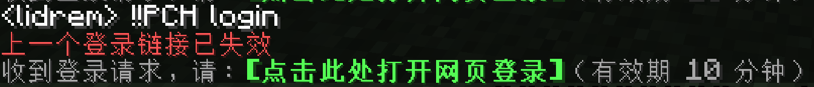
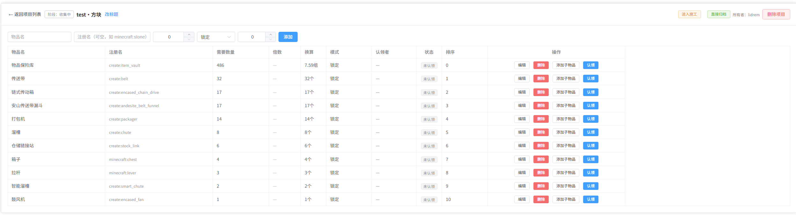
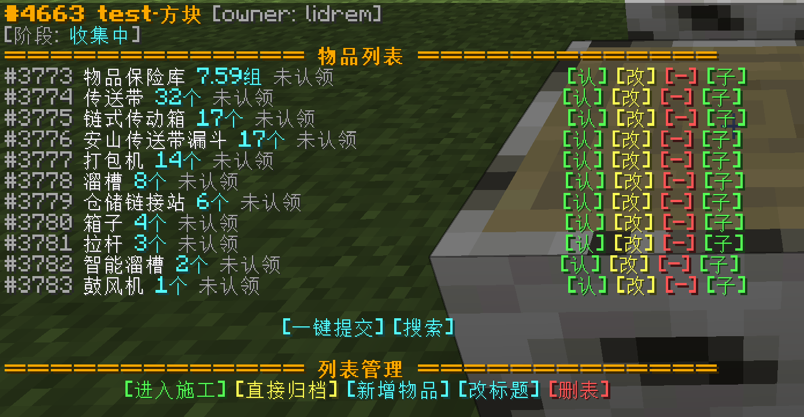
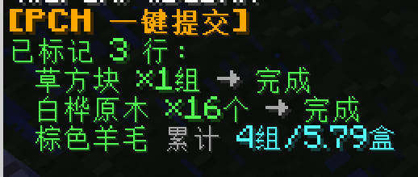
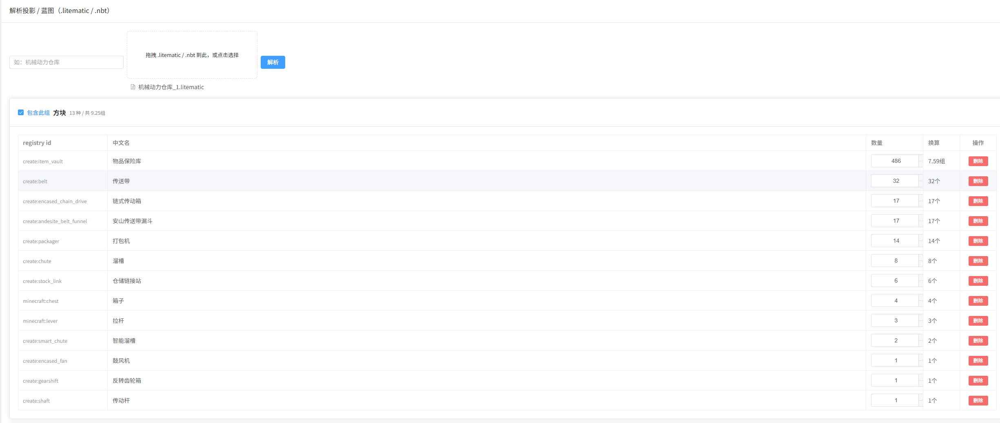
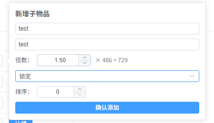
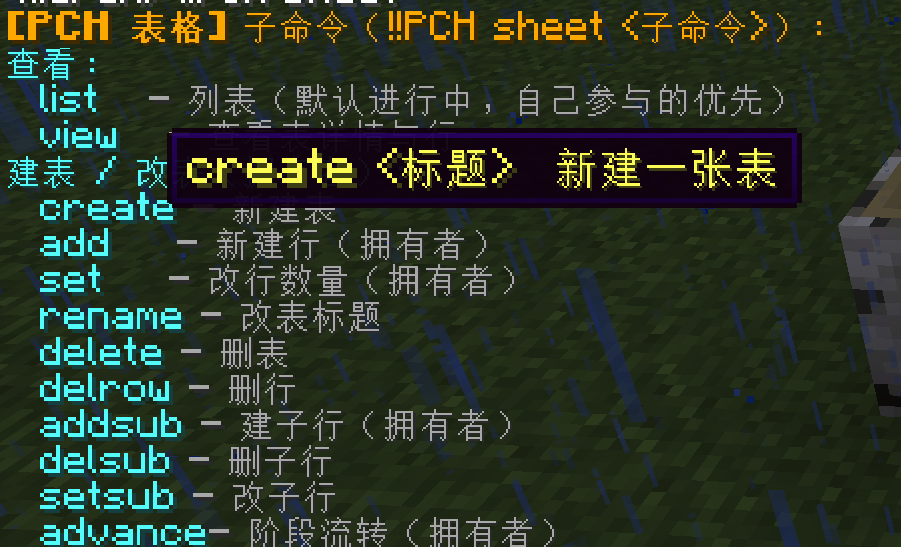
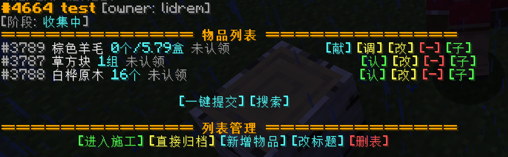
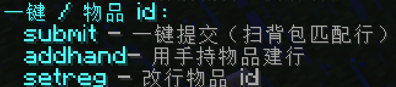
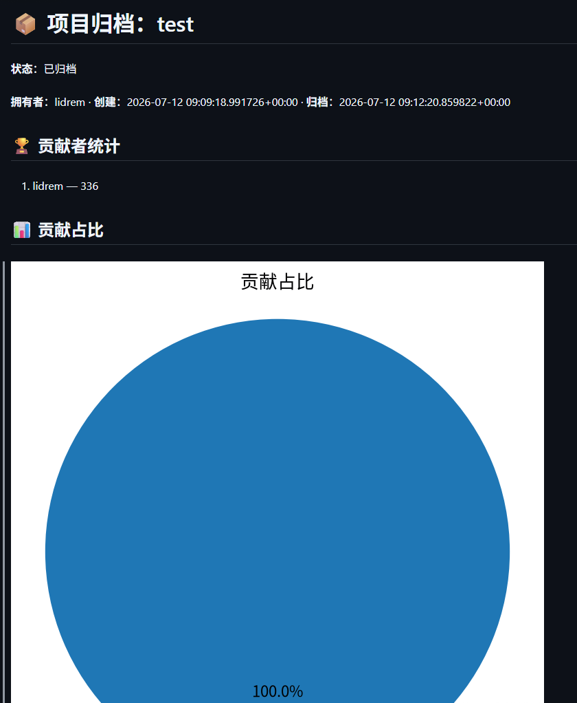

# PCH System

PCHSystem 的**游戏内端**——把「项目制工程协作 + 荣誉激励」搬进 Minecraft：玩家在游戏里登录后台、协作完成工程项目、提交材料、（将来）赚取积分与称号。

> ⚠️ **非即装即用 · 强依赖后端**
> 本插件是 [PCHSystem](https://github.com/YuShenLiu06/PCHSystem) 后端（FastAPI + PostgreSQL）的游戏内客户端，**必须先自部署后端**才能工作。单独安装本插件不会有任何功能——所有命令都是对后端的 HTTP 调用，插件市场 / `!!MCDR plugin install` **不进行完整部署** 具体查看 [部署](#部署) 章节。
>
> ⚠️ **仍在开发中**：当前版本仅实现了规划功能的一部分（见下方「开发状态」），积分、称号等核心玩法尚未交付。

完整文档：见[主仓库](https://github.com/YuShenLiu06/PCHSystem) `Docs/`。

---

## 功能特性

### 特性

- **后端分离**：游戏内端与后端完全分离，后端可独立部署，游戏内端仅作为客户端。同时由于后端的原理，理论上支持**跨服 / 跨平台**协作。
- **独立前端**：提供独立的 Web 前端，玩家可在 Web 端查看项目进度、编辑材料清单、上传投影 / 蓝图等。可以在不进入游戏的情况系进行查看进度以及协作。同时也支持在MCDR 服务或服务器重启的时候挂掉的时候也提供相关服务

### 功能（已实现）

- **游戏内登录后台**：`!!PCH login` 一键生成登录链接，点击直接进入 web 页面方便操作

    

- **项目协作（在线表格）**：完整的项目材料清单协作——认领材料、多人累计上交、交付确认、打回返工、解除锁定，Web 端与游戏端**对等操作**

    
    

    - 一键提交：支持一键扫描背包（支持潜影盒内物品）上报进度。

        

    - 投影 / 蓝图一键建表：上传 `.litematic` 投影或机械动力 `.nbt` 蓝图，自动解析方块、翻译成中文名、生成材料清单（支持原版与 Create 模组物品）（仅 web 端支持）

        
    - 子物品：一键通过倍数（支持小数）来直接生成子一级的合成物品的清单

        
        

    - 快捷命令：游戏内大量命令已经通过可点击的方式来达到便携化，尽可能的减少手打命令的状况

        

    - 智能数量换算：自动将数量换算成可读性更高的 个/组/盒 （正在考虑加入箱盒）

        

    - 游戏内快速读取手持 `registry-id` 直接更改所需的物品 id，新增物品，去除手打物品 id 的苦恼

        

    - Web 端行编辑：在线编辑材料行（名称 / 数量 / `registry-id`），与游戏端操作对等

        

- **项目归档**：项目完结自动生成归档文档 + 贡献占比饼图，精确记录每位参与者的贡献

    

- **通知投递**：认领 / 交付 / 打回 / 项目状况变化 / 上交等事件游戏内自动通知，离线期间的通知上线补推

    
    
    

### 规划中（尚未实现）

- **积分体系**：提供统一积分层，管理相关内容
    - 提供统一积分入账层
    - 提供统一积分出账层
    - 提供积分排行榜
    - 完善项目归档自动结算积分
- **指数增长称号**：积分达标自动解锁，聊天前缀差异化，高阶全服公告
- **项目协作（施工阶段）**：真正校验建造放置（当前施工阶段为占位）
    - 提供实时的计分板进度显示
- **Wiki 归档同步**：归档内容双向同步到 wiki.js
    - 项目权限继承：将项目拥有者，admin，自动拥有该篇归档 wiki 的编辑权限

> 详见下方「开发状态」与 [`TODO.md`](../TODO.md)。

---

## 玩法一览

PCHSystem 面向**白名单生电社区服**，围绕「**项目制协作 + 积分作为目标驱动**」组织玩法。游戏内端是这套体系的操作入口。

- **项目制协作**：玩家发起或参与工程项目。负责人导入投影生成材料清单，参与者认领材料、上交 / 放置，系统跟踪进度，完结后归档沉淀。
- **黄皮子积分**（*规划中*）：项目设固定积分池，按玩家交付 / 贡献占比分配——物品收集类按材料占比；建造放置类按放置 + 收集加权；负责人享额外奖励。
- **荣誉激励**（*规划中*）：总榜 / 赛季榜 / 项目榜；积分达标解锁指数增长的称号，聊天前缀展示，高阶称号解锁社区权益。

> 完整玩法设计见 [`Docs/guied.md`](../Docs/guied.md)。⚠️ **积分 / 称号 / 自治等玩法依赖的后端能力尚未交付，当前主要可用的是项目协作与归档。**

## 依赖

### MCDR 插件依赖

| 插件 | 版本 / 来源 | 用途 |
|---|---|---|
| [MCDReforged](https://github.com/Fallen-Breath/MCDReforged) | `>= 2.14.0` | 运行时 |
| `uuid_api_remake` | [gubaiovo/MCDR_uuid_api_remake](https://github.com/gubaiovo/MCDR_uuid_api_remake) | 离线模式 UUID 推导 |
| `minecraft_data_api` | MCDR 插件市场搜索 `MinecraftDataAPI` | 物品 / NBT 查询（一键提交依赖） |

> `!!MCDR plugin install` 是否会自动安装上述前置插件尚未最终确认，建议手动预装。

### ⚠️ 后端服务（必需）

本插件**强依赖 PCHSystem 后端**（FastAPI + PostgreSQL），后端需另行部署：

- 所有 `!!PCH` 命令经 HTTP 调用后端；
- 插件**不存储业务数据**——积分、项目、权限全在后端 PostgreSQL；
- 后端**不是 MCDR 插件**，不在 MCDR 运行时模型内，插件市场装不出。

这也是本插件**目前尚未提交到 MCDR 官方 catalogue** 的原因，背景见[发布策略报告](../Docs/Reports/mcdr-publishing-strategy.md)。

---

## 部署

「部署插件」=「部署 PCHSystem 全栈 + 把插件放进 MCDR」。两条路：

### A. 快速部署（一键脚本 · 推荐）

```bash
git clone https://github.com/YuShenLiu06/PCHSystem.git

#也可以使用 gitee 镜像站

git clone https://gitee.com/yushenliu03/PCHSystem.git

cd PCHSystem
bash Scripts/install.sh
```

自动完成：检测/安装 Docker、国内网络镜像自适应、生成配置（含强随机密钥）、起容器 + 跑数据库迁移、构建前端、把 `pch_system` 拷到你的 MCDR `plugins/` 并填好 `service_token`。完整选项与边界见 [`Scripts/README.md`](../Scripts/README.md)。

### B. 手动部署

按 [`Docs/RUNBOOK.md`](../Docs/RUNBOOK.md) §3：

---

## 游戏内命令

| 命令 | 说明 |
|---|---|
| `!!PCH login` | 申请 Web 登录，回显可点击链接 |
| `!!PCH sheet list / view / add / claim / deliver / contribute / advance / ...` | 项目协作全套 |
| `!!sheet` / `!!sheet <id>` | 快速重开上次 / 指定项目 |
| `!!submit` / `!!submit <id>` | 一键扫背包提交匹配材料到上次打开的项目 / 制定项目 |
| `!!PCH sheet list -m / -c / -t / -a / -l` | 列表筛选简写旗标（可组合，如 `-ma`） |


> 完整命令树（含积分、称号等**开发中**命令）见 [`McdrPlugin/CLAUDE.md`](./CLAUDE.md) §4。

---

## ⚠️ 开发状态（未完成）

**当前版本仅实现了规划中的部分功能，后续版本会持续更新。**

| 状态 | 模块 |
|---|---|
| ✅ 已交付 | 登录鉴权、项目协作（sheets）、投影 / 蓝图解析、材料上交、项目归档、通知投递、一键部署 |
| 🚧 规划中 | 积分结算、称号系统、施工方块检测、Wiki 同步、风控告警、社区自治 |

因此游戏内部分命令（如积分 `!!PCH score`、称号 `!!PCH title`）对应的后端能力**尚未落地**，待后续版本补齐。完整待办见 [`TODO.md`](../TODO.md)，已交付变更见 [`CHANGELOG.md`](../CHANGELOG.md)。

---

## 相关链接

| 内容 | 路径 |
|---|---|
| 主仓库 | <https://github.com/YuShenLiu06/PCHSystem> |
| 玩法设计 | [`Docs/guied.md`](../Docs/guied.md) |
| 工程架构总览 | [`Docs/architecture.md`](../Docs/architecture.md) |
| 本插件架构（权威） | [`Docs/architecture/services/mcdr-plugin.md`](../Docs/architecture/services/mcdr-plugin.md) |
| 发布策略报告 | [`Docs/Reports/mcdr-publishing-strategy.md`](../Docs/Reports/mcdr-publishing-strategy.md) |
| 部署脚本说明 | [`Scripts/README.md`](../Scripts/README.md) |
| 运维手册 | [`Docs/RUNBOOK.md`](../Docs/RUNBOOK.md) |
| 变更日志 | [`CHANGELOG.md`](../CHANGELOG.md) |
| 待办清单 | [`TODO.md`](../TODO.md) |
