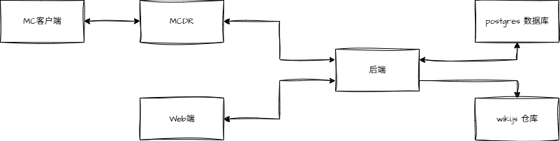

# HTCMC Project Contribution & Honor System

> 面向白名单生电社区服的**项目制工程贡献与荣誉体系**系统。
> 三端分离（Web 端 · 游戏端 · 后端），纯荣誉激励，流程全自动，运营轻量化。

---

## 项目定位

| 维度 | 内容 |
|---|---|
| 服务端 | Minecraft · **Fabric + Create + Carpet**（离线模式） |
| 玩法核心 | 项目制协作 · 黄皮子积分体系 · 指数称号 · 名人堂归档 |
| 设计原则 | 风控前置入服 · 流程全自动化 · 运营轻量化 |
| 激励属性 | **纯荣誉**（积分不可自由转移、不可交易） |

**三端职责**（Web / 游戏 / 后端）：

- **Web 端（Vue3 + Element Plus）**：浏览器后台——项目配置、材料清单上传、积分结算查询、权限管控、进度监控。
- **游戏端（MCDR 插件 + MC 服务端）**：游戏内命令菜单、箱子批量提交、UUID 推导、称号实时生效；经 HTTP API 与后端通信。
- **后端（FastAPI + PostgreSQL + wiki.js）**：唯一数据拥有者——积分引擎、身份与权限、项目与材料清单、wiki git 双向同步、风控告警，全部集中于此。

---

## 架构总览

三端完全分离，后端为唯一数据拥有者，MCDR 仅作游戏内客户端，wiki.js 经 git 仓双向同步（默认关闭）。



完整架构图与 ADR 见 [`Docs/architecture.md`](./Docs/architecture.md)。

---

## 技术栈

| 层 | 选型 |
|---|---|
| 后端 | Python · FastAPI · **模块化单体**（单库单服务，schema 隔离） |
| 前端 | Vue 3 · Element Plus · Vite · Pinia |
| 数据库 | PostgreSQL 16（Alembic 迁移，唯一业务库） |
| MC 层 | MCDReforged 插件（仅游戏内客户端，不直连数据库） |
| Wiki | wiki.js（经 git 仓双向同步，默认关闭） |
| 部署 | Docker Compose |
| 关键库 | [`litemapy`](https://github.com/SmylerMC/litemapy)（投影解析）、[`amulet-nbt`](https://github.com/Amulet-Team/amulet-nbt)（SNBT 解析，不自研） |

---

## 仓库结构

```
PCHSystem/
├── CLAUDE.md                 # 根规范（红线 R-1~R-12、命名、技术栈）
├── CONTRIBUTING.md           # 分支 / Commit / SemVer / MCDR 发布
├── CHANGELOG.md              # 三端变更日志
├── TODO.md                   # 未来规划待办
├── docker-compose.yml        # postgres + backend（wiki.js 独立部署，未入 compose）
├── .env.example              # compose 环境变量模板
│
├── Docs/                     # 架构与设计文档（权威）
│   ├── architecture.md       #   工程架构总览
│   ├── guied.md              #   玩法设计（黄皮子积分 / 称号 / 项目制）
│   ├── RUNBOOK.md            #   运维手册（部署 / 排错 / 回滚）
│   ├── architecture/         #   data-model / frontend / services/*
│   ├── Cheatsheets/          #   开发指令速查
│   ├── Reports/              #   决策与计划报告（如 MCDR 发布策略）
│   └── McdrPlugin/           #   MCDR API 速查
│
├── Backend/                  # FastAPI 模块化单体后端
├── Frontend/                 # Vue3 后台
├── McdrPlugin/               # MCDReforged 插件（含 README 市场入口）
├── Scripts/                  # 一键安装 / 更新脚本（install.sh / update.sh）
├── TestServer/               # 集成测试用 Docker 测试服
├── Archive/                  # 项目归档产物（Markdown + 贡献图）
└── Material/                 # 素材与参考
```

> 各子服务目录下各有自己的 `CLAUDE.md`（雷点 / 关键要素 / 文档索引），由 `service-claude-md` skill 维护。

---

## 快速开始

### 依赖

- Docker + Docker Compose
- Python 3.11+（MCDR 插件开发 / 后端本地调试）
- Node.js 18+（前端开发）
- Minecraft 服务端（由于 MCDR 良好的兼容性，我们几乎可以在所有我的世界服务端上运行）

### 启动后端 + 数据库

```bash
cp .env.example .env       # 按需修改密码与密钥
docker compose up -d        # 启动 backend + postgres
curl http://localhost:8000/healthz
```

### 生产部署（一键脚本）

面向服主的一键安装/更新脚本（自动检测/安装 Docker、国内网络镜像自适应、智能重建矩阵、`htcmc_auth` 插件部署 + token 双写）：

```bash
bash Scripts/install.sh   # 首次安装（交互式，幂等）
bash Scripts/update.sh    # 之后日常更新
```

完整用法（选项、镜像策略、排错、密钥轮换）见 [`Scripts/README.md`](./Scripts/README.md)。

### 本地开发

详见各子目录 README / CLAUDE.md：

- 后端：[`Backend/CLAUDE.md`](./Backend/CLAUDE.md)
- 前端：[`Frontend/CLAUDE.md`](./Frontend/CLAUDE.md)
- MCDR 插件：[`McdrPlugin/CLAUDE.md`](./McdrPlugin/CLAUDE.md)
- 集成测试服：[`TestServer/README.md`](./TestServer/README.md)

---

## 文档导航

### 架构与设计
| 文档 | 说明 |
|---|---|
| [工程架构总览](./Docs/architecture.md) | 三端架构、技术栈、ADR、风险矩阵、跨服务流程 |
| [玩法设计](./Docs/guied.md) | 黄皮子积分体系、项目管理、荣誉激励、风控 |
| [数据模型](./Docs/architecture/data-model.md) | 全部表结构、约束、索引、ER 图 |
| [前端文档](./Docs/architecture/frontend.md) | Vue3 后台模块、鉴权、构建 |

### 服务文档
| 服务 | 职责 |
|---|---|
| [MCDR 插件](./Docs/architecture/services/mcdr-plugin.md) | 命令、箱子扫描、UUID 推导、称号下发、HTTP 上报 |
| [user-service](./Docs/architecture/services/user-service.md) | MC 绑定 / Token / wiki 账号映射 / 权限 |
| [project-service](./Docs/architecture/services/project-service.md) | 项目生命周期 + `.litematic` / `.nbt` 解析 + 材料清单 |
| [scoring-service](./Docs/architecture/services/scoring-service.md) | 提交入库 + 放置贡献 + 黄皮子积分引擎 |
| [title-service](./Docs/architecture/services/title-service.md) | 指数称号体系 + scoreboard 前缀下发 |
| [wiki-service](./Docs/architecture/services/wiki-service.md) | git 双向同步归档 + 用户组 + Page Rules 授权 |
| [alert-service](./Docs/architecture/services/alert-service.md) | 异常检测 + Notifier 抽象 |

### 工程规范
| 文档 | 说明 |
|---|---|
| [根 CLAUDE.md](./CLAUDE.md) | 全项目红线、命名规范、技术栈约束 |
| [CONTRIBUTING.md](./CONTRIBUTING.md) | 分支模型 / Conventional Commits / 各组件独立 SemVer / MCDR 发布 |
| [CHANGELOG.md](./CHANGELOG.md) | 三端变更记录 |
| [Docs/RUNBOOK.md](./Docs/RUNBOOK.md) | dev/staging 运维：部署 / 健康检查 / 排错 / 回滚 |

---

## 当前状态

变更记录见 [`CHANGELOG.md`](./CHANGELOG.md)，后续规划见 [`TODO.md`](./TODO.md)。

---

## 贡献

提 PR 前请先读：

1. [根 CLAUDE.md](./CLAUDE.md) §3 的红线 R-1~R-12（任何改动不得违反）
2. [CONTRIBUTING.md](./CONTRIBUTING.md) 的分支模型与 Commit 规范
3. 涉及 MCDR 的改动必须先联网核实 API（见根 CLAUDE.md §0 S-1）

---

*最后更新：2026-07-07*
